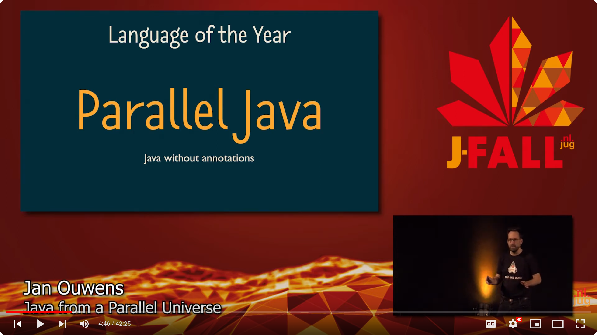
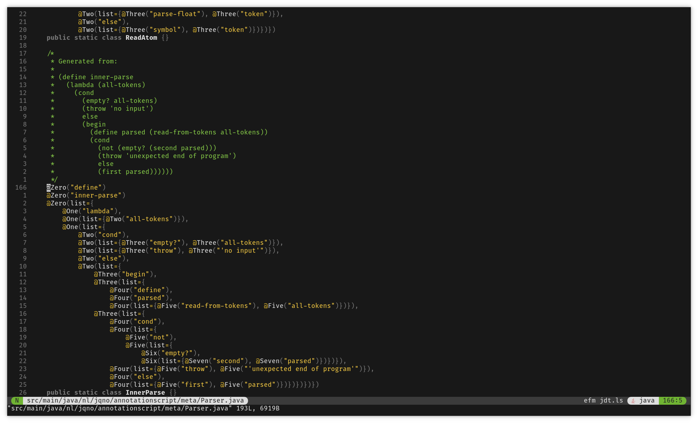

# Building a<br/>Bullsh\*t Language { data-state="page-title" data-background-image="../images/background.png" }

<!-- markdownlint-disable MD003 MD033 MD045 -->

<div>
{ .whitebackground .shadow height=240px }
</div>

::: hashtag
{ height=30px } #bullshitlanguage
:::

# Building a<br/>Bullsh\*t Language { data-state="page-title" data-background-image="../images/background.png" }

<div>
{ height=240px }
</div>

::: hashtag
{ height=30px } #bullshitlanguage
:::

##

::: big
AnnotationScript
:::

Java annotations with a LISP

##

::: superbig
Demo time!
:::

## Jan Ouwens { data-state="page-title" data-background-image="../images/background.png" }

{ .shadow style="height:200px;" }

&nbsp;

{ style="height:40px;margin-top:15px;" } │ [EqualsVerifier](https://jqno.nl/equalsverifier) │ [jqno.nl](https://jqno.nl) │ { style="height:30px;" } [jqno](https://twitter.com/jqno)

::: hashtag
{ style="height:30px;" } #bullshitlanguage
:::

## Climate for developers&nbsp;&nbsp;&nbsp;&nbsp;&nbsp;&nbsp;&nbsp;&nbsp;&nbsp;&nbsp;&nbsp;&nbsp; { data-state="page-title" data-background-image="../images/climate-change.png" }

<br/><br/><br/><br/><br/><br/><br/><br/>

Read more at [jqno.nl/climate](https://jqno.nl/climate/)

## Weird projects

. . .

{ .bigimg }

## Weird project: Vim

{ .bigimg }

## Weird project: Astérix

::: stacked-image-container
{ .bigimg .stacked-image }
:::

## Weird project: Astérix

::: stacked-image-container
{ .bigimg .stacked-image }
{ .bigimg .stacked-image }
:::

## Weird project: Astérix

::: stacked-image-container
{ .bigimg .stacked-image }
{ .bigimg .stacked-image }
{ .bigimg .stacked-image }
:::

## Weird project: Astérix

::: stacked-image-container
{ .bigimg .stacked-image }
{ .bigimg .stacked-image }
{ .bigimg .stacked-image }
{ .bigimg .stacked-image }
:::

## Weird project: Astérix

::: stacked-image-container
{ .bigimg .stacked-image }
{ .bigimg .stacked-image }
{ .bigimg .stacked-image }
{ .bigimg .stacked-image }
{ .bigimg .stacked-image }
:::

## Weird project: Lego

::: stacked-image-container
{ .bigimg .stacked-image .whitebackground }
:::

## Weird project: Lego

::: stacked-image-container
{ .bigimg .stacked-image .whitebackground }
{ .bigimg .stacked-image }
:::

## Weird project: Lego

::: stacked-image-container
{ .bigimg .stacked-image .whitebackground }
{ .bigimg .stacked-image }
{ .bigimg .stacked-image }
:::

## Weird project: Lego

::: stacked-image-container
{ .bigimg .stacked-image .whitebackground }
{ .bigimg .stacked-image }
{ .bigimg .stacked-image }
{ .bigimg .stacked-image }
:::

## Weird project: Lego

::: stacked-image-container
{ .bigimg .stacked-image .whitebackground }
{ .bigimg .stacked-image }
{ .bigimg .stacked-image }
{ .bigimg .stacked-image }
{ .bigimg .stacked-image }
:::

## Weird project: Lego

::: stacked-image-container
{ .bigimg .stacked-image .whitebackground }
{ .bigimg .stacked-image }
{ .bigimg .stacked-image }
{ .bigimg .stacked-image }
{ .bigimg .stacked-image }
{ .bigimg .stacked-image }
:::

## Weird project: Lego

::: stacked-image-container
{ .bigimg .stacked-image .whitebackground }
{ .bigimg .stacked-image }
{ .bigimg .stacked-image }
{ .bigimg .stacked-image }
{ .bigimg .stacked-image }
{ .bigimg .stacked-image }
{ .bigimg .stacked-image }
:::

## Weird project: Parallel Java

::: stacked-image-container
{ .bigimg .stacked-image }
:::

## Weird project: Parallel Java

::: stacked-image-container
{ .bigimg .stacked-image }
{ .bigimg .stacked-image }
:::

## Weird project: Parallel Java

::: stacked-image-container
{ .bigimg .stacked-image }
{ .bigimg .stacked-image }
{ .bigimg .stacked-image }
:::

## Weird project: Parallel Java

::: stacked-image-container
{ .bigimg .stacked-image }
{ .bigimg .stacked-image }
{ .bigimg .stacked-image }
{ .bigimg .stacked-image }
:::

## Weird project: Parallel Java

::: stacked-image-container
{ .bigimg .stacked-image }
{ .bigimg .stacked-image }
{ .bigimg .stacked-image }
{ .bigimg .stacked-image }
{ .bigimg .stacked-image }
:::

## Weird project: AnnotationScript

<br/>

Let's do the opposite!

<br/><br/>

no annotations → only annotations

## Weird project: AnnotationScript

<br/>

::: big
The weirdest yet!
:::

## WHY!?

. . .

Why not?

## WHY!?

```java
@Autowired
@Bean
@Column(name = "wat")
@Deprecated
@JsonAlias("whynot")
@PostMapping("/endpoint/wtf")
@Test
public void waitwhat() {}
```

## WHY!?

{ .bigimg }

## WHY!?

{ .bigimg }

## WHY!?

{ .bigimg }

## WHY!?

I got excited with this one!

. . .


## Also

No ChatGPT

. . .

::: small
Except for the final demo
:::

##

::: big
AnnotationScript

is

a LISP
:::

# { data-state="page-title" data-background-image="../images/background.png" }

::: superbig
LISP
:::

# { data-state="page-title" data-background-image="../images/background.png" }

::: superbig
(LISP)
:::

# { data-state="page-title" data-background-image="../images/background.png" }

::: superbig
((LISP))
:::

# { data-state="page-title" data-background-image="../images/background.png" }

::: superbig
(((LISP)))
:::

## What's a LISP?

- Common Lisp
- Scheme
- Emacs
- Racket
- Clojure

## Syntax

```scheme
(define (fizzbuzz x y)
  (cond ((eq? (remainder x 15) 0) (display "FizzBuzz\n"))
        ((eq? (remainder x 3) 0) (display "Fizz\n"))
        ((eq? (remainder x 5) 0) (display "Buzz\n"))
        (else (display x) (display "\n")))

  (cond ((< x y) (fizzbuzz (+ x 1) y))
        (else ())))

(fizzbuzz 1 100)
```

## Syntax

```lisp
(+ x 10)
```

## Syntax

```lisp
(+ x 10)

(+ x (* 2 5))
```

## The Power of LISP

```lisp
(+ x 10)

(+ x (* 2 5))

((if #t + -) x 10)
```

## ((Parentheses))

. . .

```java
if (this.getId().equals(that.getId()))
```

```lisp
(if (= (getId this) (getId that)))
```

## Recursion

```java
public int sum(int n) {
    int result = 0;
    for (int i = 0; i < n; i++) {
        result += i;
    }
    return result;
}
```

## Recursion

```java
public int sum(int n) {
    if (n == 0) {
        return 0;
    }
    else {
        return n + sum(n - 1);
    }
}
```

## Recursion

```lisp
(define (sum n)
  (cond ((eq? n 0) 0)
        (else (+ n (sum (- n 1))))))
```

## Stack overflow

. . .

{ .bigimg }

## Stack overflow

```plaintext
java.lang.StackOverflowError
        at java.base/java.util.Objects.hashCode(Objects.java:103)
        at io.vavr.collection.HashArrayMappedTrieModule$AbstractNode.get(HashArrayMappedTrie.java:235)
        at io.vavr.collection.HashMap.get(HashMap.java:615)
        at nl.jqno.annotationscript.language.Environment.lookupOption(Environment.java:16)
        at nl.jqno.annotationscript.language.Environment.lookup(Environment.java:20)
        at nl.jqno.annotationscript.language.Evaluator.evaluateSymbol(Evaluator.java:53)
        at nl.jqno.annotationscript.language.Evaluator.evaluate(Evaluator.java:21)
        at nl.jqno.annotationscript.language.Evaluator.evaluateProc(Evaluator.java:117)
        at nl.jqno.annotationscript.language.Evaluator.evaluate(Evaluator.java:45)
        at nl.jqno.annotationscript.language.Evaluator.lambda$4(Evaluator.java:121)
        at io.vavr.collection.Traversable.foldLeft(Traversable.java:493)
        at nl.jqno.annotationscript.language.Evaluator.evaluateProc(Evaluator.java:120)
        at nl.jqno.annotationscript.language.Evaluator.evaluate(Evaluator.java:45)
        at nl.jqno.annotationscript.language.Evaluator.lambda$0(Evaluator.java:76)
        at io.vavr.collection.Traversable.find(Traversable.java:458)
        at nl.jqno.annotationscript.language.Evaluator.evaluateCond(Evaluator.java:76)
        at nl.jqno.annotationscript.language.Evaluator.evaluate(Evaluator.java:33)
```

## Stack overflow

```lisp
(sum 4)
(+ 4 (sum 3))
(+ 4 (+ 3 (sum 2)))
(+ 4 (+ 3 (+ 2 (sum 1))))
(+ 4 (+ 3 (+ 2 (+ 1 (sum 0)))))
(+ 4 (+ 3 (+ 2 (+ 1 0))))
(+ 4 (+ 3 (+ 2 1)))
(+ 4 (+ 3 3))
(+ 4 6)
10
```

## Tail call optimization

Let's re-write

## Tail call optimization

```lisp
(define (sum n)
  (cond ((eq? n 0) 0)
        (else (+ n (sum (- n 1))))))

(sum 4)
```

↓

```lisp
(define (sum n acc)
  (cond ((eq? n 0) acc)
        (else (sum (- n 1) (+ n acc)))))

(sum 4 0)
```

## Tail call optimization

```lisp
(sum 4)
(+ 4 (sum 3))
(+ 4 (+ 3 (sum 2)))
(+ 4 (+ 3 (+ 2 (sum 1))))
(+ 4 (+ 3 (+ 2 (+ 1 (sum 0)))))
(+ 4 (+ 3 (+ 2 (+ 1 0))))
(+ 4 (+ 3 (+ 2 1)))
(+ 4 (+ 3 3))
(+ 4 6)
10
```

## Tail call optimization

```lisp
(sum 4 0)
(sum (- 4 1) (+ 4 0))
(sum 3 4)
(sum (- 3 1) (+ 3 4))
(sum 2 7)
(sum (- 2 1) (+ 2 7))
(sum 1 9)
(sum (- 1 1) (+ 1 9))
(sum 0 10)
10
```

## Recursion

::: big
What if...
:::

recursion is not supported?

## Recursion

{ .bigimg }

## Y Combinator

. . .

{ .bigimg }

## Y Combinator

```lisp
(define Y
  (lambda (le)
    ((lambda (f) (f f))
     (lambda (f)
       (le (lambda (x) ((f f) x)))))))

```

## Y Combinator

No reasonable person can understand this

But it works

##

::: superbig
Demo time!
:::

# { data-state="page-title" data-background-image="../images/background.png" }

::: big
Annotations
:::

## Why I don't like them

## Why I don't like them

Checked at runtime

<br/><br/><br/><br/>

::: small
You have a nice, compiled, strongly-typed language underneath:

Why not use it!
:::

## Why I don't like them

Weakly typed

```java
@Autowired
@Bean
@Column(name = "wat")
@Deprecated
@JsonAlias("whynot")
@PostMapping("/endpoint/wtf")
@Test
public void waitwhat() {}
```

## Why I don't like them

Stringly typed

```java
@PreAuthorize("isFullyAuthenticated")
```

. . .

```java
@PreAuthorize("isFullyAuthenticated()")
```

## Why I don't like them

Hard to discover

{ height=300px }

## Why I don't like them

Hard to debug

<!-- prettier-ignore -->
```java
public @interface GetMapping {
    /**
     * Alias for {@link RequestMapping#name}.
     */
    @AliasFor(annotation = RequestMapping.class)
    String name() default "";

    /**
     * Alias for {@link RequestMapping#value}.
     */
    @AliasFor(annotation = RequestMapping.class)
    String[] value() default {};

    // ...
}
```

## Why I don't like them

Slow

```java
List<Class<?>> allTheClasses = scanTheClasspath();  // 👈 expensive!
for (Class<?> cls : allTheClasses) {
    for (Annotation a : cls.getAnnotations()) {
        Class<?> ann = a.getAnnotationType();
        if (ann.getName().equals("SpringBootApplication")) {
            // Start the container
        }
    }
}
```

##

::: big
Anyway
:::

## Annotations, first try

```java
@Parenthesis("if", @Parenthesis("<", "x", "0"), "'a'", "'b'")
```

## Annotations, first try

<span style="float:left;">

</span>

No nesting annotations!

## Annotations, second try

```java
@Open
@Symbol("if")
@Open@Symbol("<")@Symbol("x")@Symbol("0")@Close
@Symbol("'a'")
@Symbol("'b'")
@Close
```

## Annotations, second try

<span style="float:left;">

</span>

Sure! I'll group them for you

&nbsp;

&nbsp;

```java
Open[] opens = { @Open, @Open };
Symbol[] symbols = { @Symbol("if"), @Symbol("x"), @Symbol("0"),
                     @Symbol("'a'"), @Symbol("'b'") };
Close[] closes = { @Close, @Close };
```

## Annotations, third try

```java
public @interface Syntax {}  // 👈🏻 smart-ass!

public @interface Open extends Syntax {}
public @interface Symbol extends Syntax {}
public @interface Close extends Syntax {}

Syntax[] code = { @Open, @Symbol("if"), @Open, @Symbol("<"),
                  @Symbol("x"), @Symbol("0"), @Close, @Symbol("'a'"),
                  @Symbol("'b'"), @Close };
```

## Annotations, third try

<span style="float:left;">

</span>

No extending annotations!

## Annotations, fourth and final try

```java
@Zero("if")
@Zero(list={@One("<"), @One("x"), @One("0")})
@Zero("'a'")
@Zero("'b'")
```

## Annotations, fourth and final try

<span style="float:left;">

</span>

I see no issue with that!

. . .

Make as many as you like!

. . .

🥱

. . .

`@Zero` to `@Eleven`

## Map to AnnotationScript

```lisp
(if (< x 0) "a" "b")


```

## Map to AnnotationScript

```lisp
(
  if
  (
    <
    x
    0)
  "a"
  "b"
)
```

## Map to AnnotationScript

```lisp
(
       if
           (
          <
          x
          0  )
       "a"
       "b"
)
```

## Map to AnnotationScript

<!-- prettier-ignore -->
```java

@Zero("if")
@Zero(list={
    @One("<"),
    @One("x"),
    @One("0")})
@Zero("'a'")
@Zero("'b'")
public static class First {}
```

# { data-state="page-title" data-background-image="../images/background.png" }

::: big
Implementation
:::

## Implementing LISP

{ .bigimg }

&nbsp;

## Implementing LISP

Using Peter Norvig's blog post:

_[(How to Write a (Lisp) Interpreter (in Python)) 🔗](https://norvig.com/lispy.html)_

## Architecture

{ .shadow .whitebackground }

## Architecture

{ .shadow .whitebackground }

## Tokenizer

{ .shadow .whitebackground }

## Tokenizer

<!-- prettier-ignore -->
```java
@Zero("if")
@Zero(list={
    @One("<"),
    @One("x"),
    @One("0")
})
@Zero("'a'")
@Zero("'b'")
```

## Tokenizer

<!-- prettier-ignore -->
```java
@Zero("if")       // 'if'
@Zero(list={      // '('
    @One("<"),    // '<'
    @One("x"),    // 'x'
    @One("0")     // '0'
})                // ')'
@Zero("'a'")      // 'a'
@Zero("'b'")      // 'b'
```

DONE! 🥳

## Architecture

{ .shadow .whitebackground }

## Parser

{ .shadow .whitebackground }

## Parser

- Atoms (`0`, `'a'`) remain the same
- Symbols (`define`, `if`, `<`) are wrapped in `Symbol` class
- `(` starts a sub-list
- `)` ends a sub-list

```java
List<Object> ast = List.of(
    Symbol("if"),
    List.of(Symbol("<"), Symbol("x"), 0),
    "a",
    "b");
```

::: notes
Nested Lists instead of a proper Tree
:::

## Architecture

{ .shadow .whitebackground }

## Environment

{ .shadow .whitebackground }

::: notes
Global Environment contains lots of stuff
:::

## Environment

{ .shadow .whitebackground }

```lisp
(define x 10)
```

## Environment

{ .shadow .whitebackground }

```lisp
(define x 10)
```

## Architecture

{ .shadow .whitebackground }

## Evaluator

{ .shadow .whitebackground }

## Evaluator

Is it an Atom?<br/>`0, 'a'`

↓

Return it

## Evaluator

Is it a Symbol?<br/>`if`, `<`

↓

Look up in Environment<br/>Return it

## Evaluator

Is it a List?<br/>`(< x 0)`

↓

Evaluate all elements<br/>Call function<br/>Return result

## Tail call optimization

Evaluator works recursively

stack overflow after ~60

## Tail call optimization

Use Peter Norvig's second blog post:

[(An ((Even Better) Lisp) Interpreter (in Python)) 🔗](https://norvig.com/lispy2.html)

## Tail call optimization

- Add mutability
- Evaluate procedure calls in-place

## Tail call optimization

Instead of this:

```java
public Object evaluate(Object expression) {
    // ...
    if (isAtom(expression)) {
        return evaluateAtom(expression);
    }
    if (isProc(expression)) {
        var evaluated = evaluateProc(expression);
        return evaluate(evaluated); // 👈 recursive call
    }
}
```

## Tail call optimization

We do this:

```java
public Object evaluate(Object expression) {
    var exp = expression;
    while (true) {
        // ...
        if (isAtom(exp)) {
            return evaluateAtom(expression);
        }
        if (isProc(exp)) {
            exp = evaluateProc(exp); // 👈 loop
        }
    }
}
```

## Tail call optimization

No more stack overflow 🥳

# { data-state="page-title" data-background-image="../images/background.png" }

::: superbig
Interlude
:::

## Code sample

<!-- prettier-ignore -->
```java
@Zero("begin")
@Zero(list={@One("define"), @One("fizz-buzz"), @One(list={@Two("lambda"),
  @Two(list=@Three("n")), @Two(list={@Three("cond"),
    @Three(list={@Four("="), @Four(list={@Five("%"), @Five("n"),
      @Five("15")}), @Four("0")}), @Three("'fizzbuzz'"),
    @Three(list={@Four("="), @Four(list={@Five("%"), @Five("n"),
      @Five("3")}), @Four("0")}), @Three("'fizz'"),
    @Three(list={@Four("="), @Four(list={@Five("%"), @Five("n"),
      @Five("5")}), @Four("0")}), @Three("'buzz'"),
    @Three("else"), @Three("n")})})})
@Zero(list={@One("map"), @One("println"), @One(list={@Two("map"),
  @Two("fizz-buzz"), @Two(list={@Three("range"),
  @Three("1"), @Three("101")})})})
public class FizzBuzz {}
```

## Ain't nobody got no time for that

{ .bigimg }

## Write normal LISP

```lisp

  (begin
    (define fizz-buzz (lambda (n)
      (cond (= (% n 15) 0) 'fizzbuzz')
      (cond (= (% n 3) 0) 'fizz')
      (cond (= (% n 5) 0) 'buzz')
      (else n))
    (map println (map fizz-buzz (range 1 101))))

```

## Wrap it

```lisp
String code = """
  (begin
    (define fizz-buzz (lambda (n)
      (cond (= (% n 15) 0) 'fizzbuzz')
      (cond (= (% n 3) 0) 'fizz')
      (cond (= (% n 5) 0) 'buzz')
      (else n))
    (map println (map fizz-buzz (range 1 101))))""";
```

## Tokenizer

```lisp
String code = """
  (begin
    (define fizz-buzz (lambda (n)
      (cond (= (% n 15) 0) 'fizzbuzz')
      (cond (= (% n 3) 0) 'fizz')
      (cond (= (% n 5) 0) 'buzz')
      (else n))
    (map println (map fizz-buzz (range 1 101))))""";

return code
    .replace("(", " ( ")
    .replace(")", " ) ")
```

## Tokenizer

```lisp
String code = """
  (begin
    (define fizz-buzz (lambda (n)
      (cond (= (% n 15) 0) 'fizzbuzz')
      (cond (= (% n 3) 0) 'fizz')
      (cond (= (% n 5) 0) 'buzz')
      (else n))
    (map println (map fizz-buzz (range 1 101))))""";

return code
    .replace("(", " ( ")
    .replace(")", " ) ")
    .split(" ");
```

## Code generator

{ .bigimg }

# { data-state="page-title" data-background-image="../images/background.png" }

::: superbig
(recurse
:::

::: notes
Now I have a quick way to produce code
:::

## MetaScript

{ .bigimg }

##

::: superbig
Demo time!
:::

## Architecture

{ .shadow .whitebackground }

## Tokenizer

{ .bigimg }

## Tokenizer

- Unit tests written in Java, not AnnotationScript

- AnnotationScript evaluates to regular Java objects

## Tokenizer

{ .regularimg }

Unit tests: identical!

::: notes
Trivial
:::

## MetaScript

{ .shadow .whitebackground }

## Parser

{ .bigimg }

## Parser

{ .regularimg }

Unit tests: identical!

::: notes
Non-trivial
:::

## MetaScript

{ .shadow .whitebackground }

## Evaluator

{ .bigimg }

::: notes
Evaluator is implemented very differently, so tests are different
:::

## Evaluator

{ .bigimg }

## Recursion issue

```lisp
(define (sum
  (lambda (i)
    (cond
      ((eq? i 0) 0)
      (else
        (+ i (sum (sub1 i)))))))

  (sum 4))
```

## Recursion issue

```lisp
(define (sum
  (lambda (i)
    (cond
      ((eq? i 0) 0)
      (else
        (+ i (sum (sub1 i)))))))

  (sum 4))
```

`cond has no true branch`

## Recursion issue

```lisp
(define (sum
  (lambda (i)
    (cond
      ((eq? i 0) 0)
      (else
        (+ i (sum (sub1 i)))))))

  (sum 4))
```

Invalid identifier: `sum`

## Recursion issue

```lisp
(define (sum
  (lambda (i)
    (cond
      ((eq? i 0) 0)
      (else
        (+ i (sum (sub1 i)))))))

  (sum 4))
```

Y Combinator ???

## Recursion issue

```lisp
(define (sum
  (lambda (i recurse)
    (cond
      ((eq? i 0) 0)
      (else
        (+ i (recurse (sub1 i) recurse))))))

  (sum 4 sum))
```

Solution: function is parameter to itself

# { data-state="page-title" data-background-image="../images/background.png" }

::: superbig
(recurse
:::

## Turing complete

I promised

. . .

But how to prove it?

## Turing complete

- Can solve any computable problem
- Need loops, if, IO
- Mathematical proof is hard and boring

## Turing machine

{ .bigimg }

## Turing machine

- Turing complete by definition
- Tape with cells
- Operations: read at head, write at head, move head

## Turing machine

Implement one!

. . .

...

. . .

::: big
Brainfuck!
:::

##

::: superbig
Demo time!
:::

<br/><br/>

::: small
[brainfuck generator 🔗](https://tnu.me/brainfuck/generator)
:::

# { data-state="page-title" data-background-image="../images/background.png" }

::: superbig
))
:::

# { data-state="page-title" data-background-image="../images/background.png" }

::: superbig
What's next
:::

## Did it escalate?

{ .bigimg }

##

::: big
Error handling
:::

`cond has no true branch`

> "[It] expects the programmer to be perfect"

##

::: big
String.split
:::

```java
"'Hello world'" → "'Hello" + "world'"
```

##

::: big
Spring integration
:::

::: supersmall
🤪
:::

::: notes
No @Autowired
:::

# { data-state="page-title" data-background-image="../images/background.png" }

::: superbig
Conclusion
:::

## Conclusion { data-background-image="../images/duke-says-yes-background.png" data-background-size="contain" }

::: big
Learn about annotations
:::

## Conclusion { data-background-image="../images/rite-of-passage.png" }

::: { class="big text-shadow" }
Learn about LISP
:::

## Conclusion { data-background-image="../images/fun.png" }

::: { class="superbig text-shadow" }
It was fun
:::

## Conclusion

Greenspun's Tenth Rule:

_Any sufficiently complicated C or Fortran program contains an ad hoc, informally-specified, bug-ridden, slow implementation of half of Common Lisp._

## Questions? { data-state="page-title" data-background-image="../images/background.png" }

<span style="float:left;width:200px;margin-top:20px;">

</span>

- [github.com/jqno/AnnotationScript](https://github.com/jqno/AnnotationScript)

- [jqno.nl/talks/bullshitlanguage](https://jqno.nl/talks/bullshitlanguage)

- [jqno.nl/climate](https://jqno.nl/climate)

{ height=130px }

::: hashtag
{ height=30px } #bullshitlanguage
:::

## { data-state="end-titles-page" }

::: end-titles
::: big
Fin
:::


::: subtitle
Image credits
:::

::: supersmall

| | |
|-|-|
| [annotationscript](/talks/slides/bullshitlanguage/images/annotationscript.png) | by [moinart on Fiverr](https://www.fiverr.com/moinart) |
| [architecture-1](/talks/slides/bullshitlanguage/images/architecture-1.png) | by Jan Ouwens |
| [architecture-2](/talks/slides/bullshitlanguage/images/architecture-2.png) | by Jan Ouwens |
| [background](/talks/slides/bullshitlanguage/images/background.png) | by Jan Ouwens |
| [bored](/talks/slides/bullshitlanguage/images/bored.png) | by DreamStudio (Stable Diffusion) with prompt _"Nerd behind laptop looking bored. Many Salvador Dali melting clocks."_ |
| [climate-change](/talks/slides/bullshitlanguage/images/climate-change.png) | by DreamStudio (Stable Diffusion) with prompt _"Laptop with image of a coal plant emitting thick black smoke. It's on a table next to a pile of books and a coffee cup. In the background lush springtime forest"_ |
| [code-generator](/talks/slides/bullshitlanguage/images/code-generator.png) | by DreamStudio (Stable Diffusion) with prompt _"Monkey typing at a computer"_ |
| [comics-0](/talks/slides/bullshitlanguage/images/comics-0.jpg) | by Jan Ouwens - picture of "Asterix de Galliër" by René Goscinny & Albert Uderzo |
| [comics-1](/talks/slides/bullshitlanguage/images/comics-1.jpg) | by Jan Ouwens - picture of a stack of comic books with on top: "Asterix de Galliër" by René Goscinny & Albert Uderzo |
| [comics-2](/talks/slides/bullshitlanguage/images/comics-2.jpg) | by Jan Ouwens - picture of a stack of comic books with on top: "Gilles de Geus - De Spaanse furie" by Hanco Kolk |
| [comics-3](/talks/slides/bullshitlanguage/images/comics-3.png) | by Jan Ouwens |
| [comics-4](/talks/slides/bullshitlanguage/images/comics-4.jpg) | by Jan Ouwens - picture of two comic books: "Astérix Légionnaire" by René Goscinny & Albert Uderzo, and "Gilles de Geus - De revue" by Hanco Kolk & Peter de Wit |
| [discoverability](/talks/slides/bullshitlanguage/images/discoverability.png) | Screenshot from IntelliJ IDEA, taken by Jan Ouwens |
| [duke-says-no](/talks/slides/bullshitlanguage/images/duke-says-no.png) | by Jeff Dinkins for Sun/Oracle - [source](https://wiki.openjdk.org/display/duke/Gallery) |
| [duke-says-yes](/talks/slides/bullshitlanguage/images/duke-says-yes.png) & [duke-says-yes-background](/talks/slides/bullshitlanguage/images/duke-says-yes-background.png) | by Jeff Dinkins for Sun/Oracle - [source](https://wiki.openjdk.org/display/duke/Gallery) |
| [environment-1](/talks/slides/bullshitlanguage/images/environment-1.png) | by Jan Ouwens |
| [environment-2](/talks/slides/bullshitlanguage/images/environment-2.png) | by Jan Ouwens |
| [escalation](/talks/slides/bullshitlanguage/images/escalation.png) | by DreamStudio (Stable Diffusion) with prompt _"A tsunami of snow coming from a mountain, a person running away from it, powdered snow in the air"_ |
| [evaluator](/talks/slides/bullshitlanguage/images/evaluator.png) | by Jan Ouwens |
| [fun](/talks/slides/bullshitlanguage/images/fun.png) | by dreamstudio (stable diffusion) with prompt _"childrens drawing of stick fligure children playing in a school playground with a swing, a slide and a tree"_ |
| [hackernews](/talks/slides/bullshitlanguage/images/hackernews.png) | Screenshot from [Hacker News](https://news.ycombinator.com/), taken by Jan Ouwens on 2023-09-11 |
| [jan-ouwens](/talks/slides/bullshitlanguage/images/jan-ouwens.jpg) | by Riemke Ouwens |
| [lego-0](/talks/slides/bullshitlanguage/images/lego-0.png) | by Jan Ouwens |
| [lego-1](/talks/slides/bullshitlanguage/images/lego-1.jpg) | by Jan Ouwens |
| [lego-2](/talks/slides/bullshitlanguage/images/lego-2.jpg) | by Jan Ouwens |
| [lego-3](/talks/slides/bullshitlanguage/images/lego-3.png) | by Jan Ouwens |
| [lego-4](/talks/slides/bullshitlanguage/images/lego-4.png) | Screenshot from [my website](https://jqno.nl/lego/tos/), taken by Jan Ouwens on 2023-09-30 |
| [lego-5](/talks/slides/bullshitlanguage/images/lego-5.png) | Screenshot from [Rebrickable](https://rebrickable.com/mocs/MOC-159312/jqno/minimalistic-star-trek-the-original-series-cast), taken by Jan Ouwens on 2023-09-29 |
| [lego-6](/talks/slides/bullshitlanguage/images/lego-6.jpg) | by Jan Ouwens |
| [lockdown](/talks/slides/bullshitlanguage/images/lockdown.png) | by DreamStudio (Stable Diffusion) with prompt _"fat nerdy person at computer. man cave. messy room with parcels, stacks of books, empty pizza boxes, gadgets"_ |
| [meta-evaluator](/talks/slides/bullshitlanguage/images/meta-evaluator.png) & [meta-parser](/talks/slides/bullshitlanguage/images/meta-parser.png) & [meta-tokenizer](/talks/slides/bullshitlanguage/images/meta-tokenizer.png) | by Jan Ouwens |
| [mind-blown-1](/talks/slides/bullshitlanguage/images/mind-blown-1.png) | by DreamStudio (Stable Diffusion) with prompt _"Person looking at a computer screen, very surprised, wide eyes, open mouth"_ |
| [mind-blown-2](/talks/slides/bullshitlanguage/images/mind-blown-2.png) | by DreamStudio (Stable Diffusion) with prompt _"Person looking at a computer screen, very surprised, wide eyes, open mouth"_ |
| [nerd-cred](/talks/slides/bullshitlanguage/images/nerd-cred.png) | by DreamStudio (Stable Diffusion) with prompt _"Rap music album cover in the style of Eminem, 50ct and notorious BIG. Photograph one face of fat, white, nerdy guy with large beard, messy hair, jewelry and colored glasses. Fish eye lens. Album title "nerd cred" appears next to face"_ |
| [paralleljava-0](/talks/slides/bullshitlanguage/images/paralleljava-0.png) | by Jan Ouwens |
| [paralleljava-1](/talks/slides/bullshitlanguage/images/paralleljava-1.png) | by Jan Ouwens |
| [paralleljava-2](/talks/slides/bullshitlanguage/images/paralleljava-2.png) | Screenshot from [GitHub](https://github.com/jqno/PicoTest) taken by Jan Ouwens on 2023-09-29 |
| [paralleljava-3](/talks/slides/bullshitlanguage/images/paralleljava-3.png) | Screenshot from [Todo-Backend](http://www.todobackend.com) taken by Jan Ouwens |
| [paralleljava-4](/talks/slides/bullshitlanguage/images/paralleljava-4.png) | by J-Fall - [source](https://www.youtube.com/watch?v=R0WnUd01f14) |
| [parser](/talks/slides/bullshitlanguage/images/parser.png) | by Jan Ouwens |
| [rite-of-passage](/talks/slides/bullshitlanguage/images/rite-of-passage.png) | by DreamStudio (Stable Diffusion) with prompt _"Graduation ceremony. Fat nerdy man with glasses and unkempt beard on stage."_ |
| [stackoverflow](/talks/slides/bullshitlanguage/images/stackoverflow.png) | Screenshot from [StackOverflow](https://stackoverflow.com/), taken by Jan Ouwens on 2023-09-11 |
| [the-little-schemer](/talks/slides/bullshitlanguage/images/the-little-schemer.jpg) | by MIT Press - [source](https://mitpress.mit.edu/9780262560993/the-little-schemer/) |
| [tokenizer](/talks/slides/bullshitlanguage/images/tokenizer.png) | by Jan Ouwens |
| [turing-machine](/talks/slides/bullshitlanguage/images/turing-machine.png) | by DreamStudio (Stable Diffusion) with prompt _"A sewing machine sewing a long, straight, white ribbon that must not be bundled up"_ |
| [vim](/talks/slides/bullshitlanguage/images/vim.png) | by Jan Ouwens |
| <br/><br/><br/> | |
| Enterprise Lego model | designed by [MiniTrekMocs](https://www.minitrekmocs.com/) |

:::

<br/>

::: supersmall
No animals were harmed during the making of this slide deck.<br/>Except bugs. Bugs were _squashed_ without hesitation.
:::
:::
