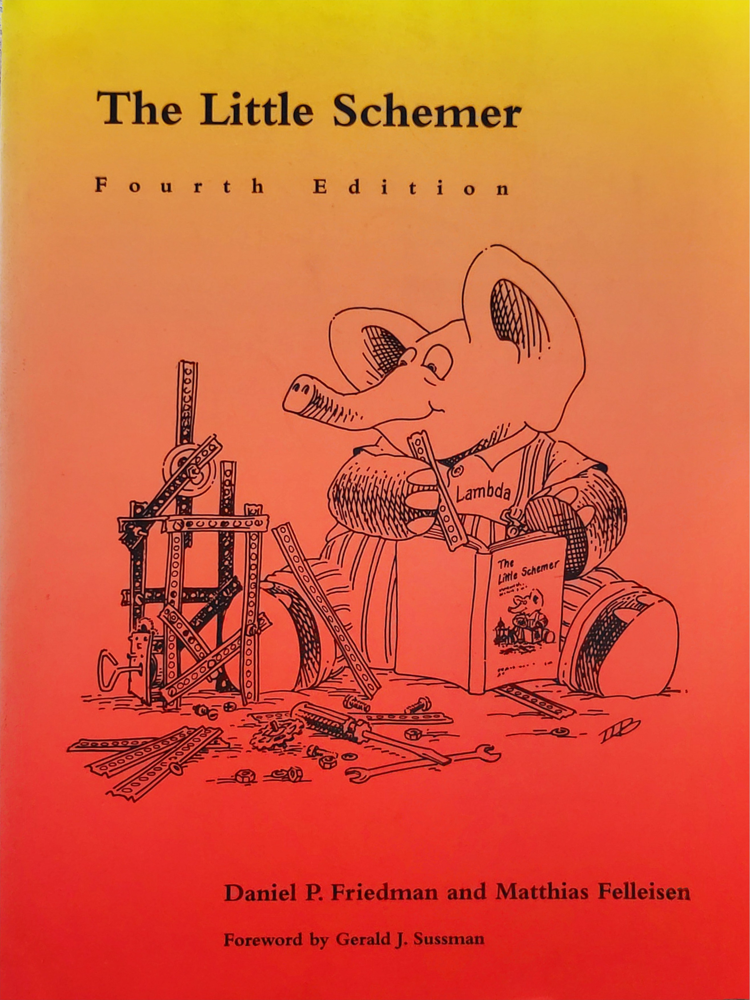
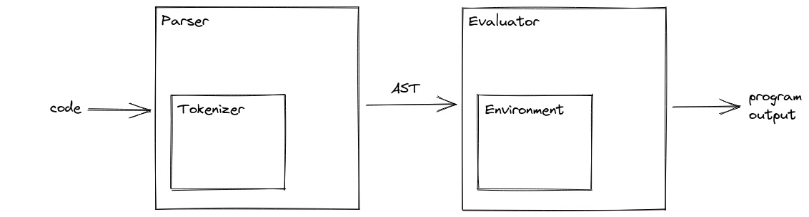
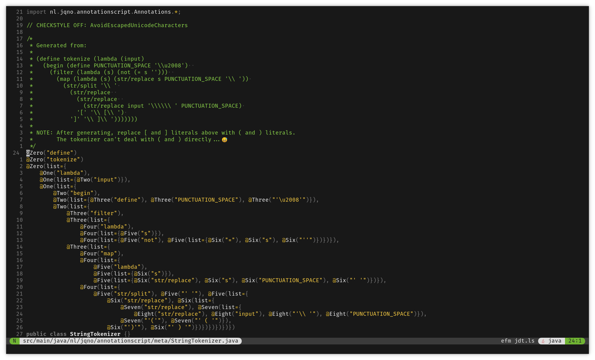
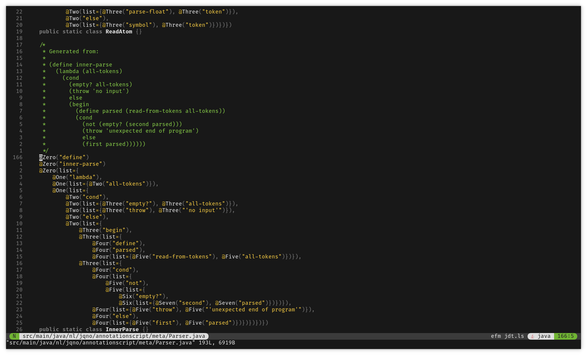
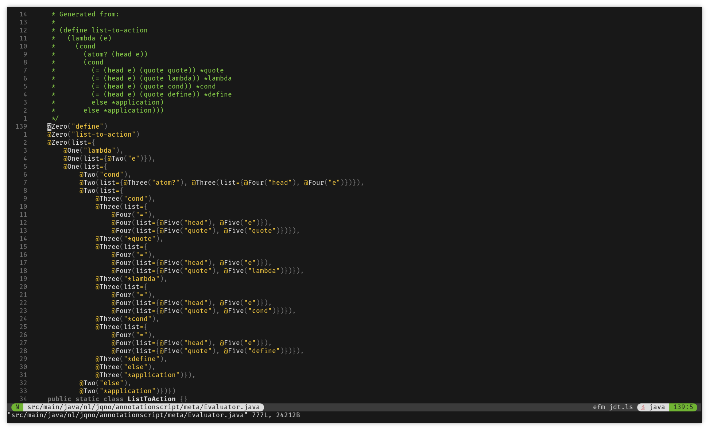

# Building a<br/>Bullshit Language { data-state="page-title" data-background-image="../images/background.png" }

<!-- markdownlint-disable MD003 MD033 MD045 -->

{ style="height:240px;" }

::: hashtag
{ height=30px } #bullshitlanguage
:::

##

::: big
AnnotationScript
:::

Java annotations with a LISP

##

::: superbig
Demo time!
:::

## Jan Ouwens { data-state="page-title" data-background-image="../images/background.png" }

{ .shadow style="height:200px;" }

&nbsp;

{ style="height:40px;margin-top:15px;" } │ [EqualsVerifier](https://jqno.nl/equalsverifier) │ [jqno.nl](https://jqno.nl) │ { style="height:30px;" } [jqno](https://twitter.com/jqno)

::: hashtag
{ style="height:30px;" } #bullshitlanguage
:::

## Climate

Reduce cloud spend

<br/><br/><br/><br/><br/><br/>

Read more at [jqno.nl/climate](https://jqno.nl/climate/)

<!-- TODO: image -->

## Weird projects

<!-- TODO: image of Asterix paper -->

## Weird projects

<!-- TODO: image of Vim dev env -->

## Weird projects

<!-- TODO: image of app with no annotations, maybe error message when @ is encountered -->

## Weird projects

I _finish_ them

<!-- TODO: image -->

## WHY!?

## WHY!?

Because I can

## WHY!?

{ .bigimg }

## WHY!?

```java
@Autowired
@Bean
@Column(name = "wat")
@Deprecated
@JsonAlias("whynot")
@PostMapping("/endpoint/wtf")
@Test
public void waitwhat() {}
```

## WHY!?

{ .bigimg }

## WHY!?

{ .bigimg }

## Also

No ChatGPT

. . .

::: small
Except for the final demo
:::

##

::: big
AnnotationScript

is

a LISP
:::

# { data-state="page-title" data-background-image="../images/background.png" }

::: superbig
LISP
:::

## What's a LISP?

- Common Lisp
- Scheme
- Emacs
- Racket
- Clojure

## Syntax

```scheme
(define (fizzbuzz x y)
  (cond ((eq? (remainder x 15) 0) (display "FizzBuzz\n"))
        ((eq? (remainder x 3) 0) (display "Fizz\n"))
        ((eq? (remainder x 5) 0) (display "Buzz\n"))
        (else (display x) (display "\n")))

  (cond ((< x y) (fizzbuzz (+ x 1) y))
        (else ())))

(fizzbuzz 1 100)
```

## Syntax

```lisp
(+ x 10)
```

## The Power of LISP

```lisp
(+ x 10)

((if (#t) + -) x 10)
```

## ((Parentheses))

. . .

```java
if (this.getId().equals(that.getId()))
```

```lisp
(if (= (getId this) (getId that)))
```

## Recursion

```java
public int sum(int n) {
    int result = 0;
    for (int i = 0; i < 10; i++) {
        result += i;
    }
    return result;
}
```

## Recursion

```java
public int sum(int n) {
    if (n == 0) {
        return 0;
    }
    else {
        return n + sum(n - 1);
    }
}
```

## Recursion

```lisp
(define (sum n)
  (cond ((eq? n 0) 0)
        (else (+ n (sum (- n 1))))))
```

## Tail call optimization

```lisp
(sum 4)
(+ 4 (sum 3))
(+ 4 (+ 3 (sum 2)))
(+ 4 (+ 3 (+ 2 (sum 1))))
(+ 4 (+ 3 (+ 2 (+ 1 (sum 0)))))
(+ 4 (+ 3 (+ 2 (+ 1 0))))
(+ 4 (+ 3 (+ 2 1)))
(+ 4 (+ 3 3))
(+ 4 6)
10
```

## Tail call optimization

<!-- TODO: image stack overflow (no, not that one) -->

## Tail call optimization

<!-- TODO: image stack overflow (yes, that one) -->

## Tail call optimization

Let's re-write

## Tail call optimization

```lisp
(define (sum n)
  (cond ((eq? n 0) 0)
        (else (+ n (sum (- n 1))))))
```

↓

```lisp
(define (sum n acc)
  (cond ((eq? n 0) acc)
        (else (sum (- n 1) (+ n acc)))))
```

## Tail call optimization

```lisp
(sum 4 0)
(sum (- 4 1) (+ 4 0))
(sum 3 4)
(sum (- 3 1) (+ 3 4))
(sum 2 7)
(sum (- 2 1) (+ 2 7))
(sum 1 9)
(sum (- 1 1) (+ 1 9))
(sum 0 10)
10
```

## Recursion

What if...

## Recursion

{ .bigimg }

## Y Combinator

TODO: image Y Combinator website (no, not that one)

## Y Combinator

```lisp
(define Y
  (lambda (le)
    ((lambda (f) (f f))
     (lambda (f)
       (le (lambda (x) ((f f) x)))))))

```

## Y Combinator

No reasonable person can understand this

But it works

## Demo

# { data-state="page-title" data-background-image="../images/background.png" }

::: big
Annotations
:::

## What you can do with them

```java
@Autowired
@Bean
@Column(name = "wat")
@Deprecated
@JsonAlias("whynot")
@PostMapping("/endpoint/wtf")
@Test
public void waitwhat() {}
```

## Why I don't like them

<!-- TODO: image of having clicked on an annotation -->

## Reading annotations

```java
List<Class<?>> allTheClasses = scanTheClasspath();  // 👈 expensive!
for (Class<?> cls : allTheClasses) {
    for (Annotation a : cls.getAnnotations()) {
        Class<?> ann = a.getAnnotationType();
        if (ann.getName().equals("SpringBootApplication")) {
            // Start the container
        }
    }
}
```

## Annotations, first try

```java
@Parenthesis("if", @Parenthesis("<", "x", "0"), "'a'", "'b'")
```

## Annotations, first try

<span style="float:left;">

</span>

No nesting annotations!

## Annotations, second try

```java
@Open
@Symbol("if")
@Open@Symbol("<")@Symbol("x")@Symbol("0")@Close
@Symbol("'a'")
@Symbol("'b'")
@Close
```

## Annotations, second try

<span style="float:left;">

</span>

Sure! I'll group them for you

&nbsp;

&nbsp;

```java
Open[] opens = { @Open, @Open };
Symbol[] symbols = { @Symbol("if"), @Symbol("x"), @Symbol("0"),
                     @Symbol("'a'"), @Symbol("'b'") };
Close[] closes = { @Close, @Close };
```

## Annotations, third try

```java
public @interface Syntax {}  // 👈🏻 smart-ass!

public @interface Open extends Syntax {}
public @interface Symbol extends Syntax {}
public @interface Close extends Syntax {}

Syntax[] code = { @Open, @Symbol("if"), @Open, @Symbol("<"),
                  @Symbol("x"), @Symbol("0"), @Close, @Symbol("'a'"),
                  @Symbol("'b'"), @Close };
```

## Annotations, third try

<span style="float:left;">

</span>

No extending annotations!

## Annotations, fourth and final try

```java
@Zero("if")
@Zero(list={@One("<"), @One("x"), @One("0")})
@Zero("'a'")
@Zero("'b'")
```

## Annotations, fourth and final try

<span style="float:left;">

</span>

I see no issue with that!

. . .

Make as many as you like!

. . .

🥱

## Map to AnnotationScript

```lisp
(if (< x 0) "a" "b")


```

## Map to AnnotationScript

```lisp
(
  if
  (
    <
    x
    0)
  "a"
  "b"
)
```

## Map to AnnotationScript

```lisp
(
       if
           (
          <
          x
          0  )
       "a"
       "b"
)
```

## Map to AnnotationScript

<!-- prettier-ignore -->
```java

@Zero("if")
@Zero(list={
    @One("<"),
    @One("x"),
    @One("0")})
@Zero("'a'")
@Zero("'b'")
public static class First {}
```

## Examples

TODO

# { data-state="page-title" data-background-image="../images/background.png" }

::: big
Implementation
:::

::: small
Use Peter Norvig's [blog post](https://norvig.com/lispy.html)
:::

## Implementing LISP

{ .shadow }

&nbsp;

## Architecture



## Architecture


## Tokenizer


## Tokenizer

<!-- prettier-ignore -->
```java
@Zero("if")
@Zero(list={
    @One("<"),
    @One("x"),
    @One("0")
})
@Zero("'a'")
@Zero("'b'")
```

## Tokenizer

<!-- prettier-ignore -->
```java
@Zero("if")       // 'if'
@Zero(list={      // '('
    @One("<"),    // '<'
    @One("x"),    // 'x'
    @One("0")     // '0'
})                // ')'
@Zero("'a'")      // 'a'
@Zero("'b'")      // 'b'
```

DONE! 🥳

## Architecture


## Parser


## Parser

- Atoms (`0`, `'a'`) remain the same
- Symbols (`define`, `if`, `<`) are wrapped in `Symbol` class
- `(` starts a sub-list
- `)` ends a sub-list

```java
List<Object> ast = List.of(
    Symbol("if"),
    List.of(Symbol('<'), Symbol('x'), 0),
    "a",
    "b");
```

::: notes
Nested Lists instead of a proper Tree
:::

## Architecture


## Environment


::: notes
Global Environment contains lots of stuff
:::

## Environment


```lisp
(define x 10)
```

## Environment


```lisp
(define x 10)
```

## Architecture


## Evaluator


## Evaluator

Is it an Atom?<br/>`0, 'a'`

↓

Return it

## Evaluator

Is it a Symbol?<br/>`if`, `<`

↓

Look up in Environment<br/>Return it

## Evaluator

Is it a List?<br/>`(< x 0)`

↓

Evaluate all elements<br/>Call function<br/>Return result

## Tail call optimization

TODO

# { data-state="page-title" data-background-image="../images/background.png" }

::: superbig
Interlude
:::

## A program

<!-- prettier-ignore -->
```java
@Zero("begin")
@Zero(list={@One("define"), @One("fizz-buzz"), @One(list={@Two("lambda"),
  @Two(list=@Three("n")), @Two(list={@Three("cond"),
    @Three(list={@Four("="), @Four(list={@Five("%"), @Five("n"),
      @Five("15")}), @Four("0")}), @Three("'fizzbuzz'"),
    @Three(list={@Four("="), @Four(list={@Five("%"), @Five("n"),
      @Five("3")}), @Four("0")}), @Three("'fizz'"),
    @Three(list={@Four("="), @Four(list={@Five("%"), @Five("n"),
      @Five("5")}), @Four("0")}), @Three("'buzz'"),
    @Three("else"), @Three("n")})})})
@Zero(list={@One("map"), @One("println"), @One(list={@Two("map"),
  @Two("fizz-buzz"), @Two(list={@Three("range"),
  @Three("1"), @Three("101")})})})
public class FizzBuzz {}
```

## A program

<!-- Image: ain't got no time to write that -->

{ .bigimg }

## Tokenizer

```lisp

  (begin
    (define fizz-buzz (lambda (n)
      (cond (= (% n 15) 0) 'fizzbuzz')
      (cond (= (% n 3) 0) 'fizz')
      (cond (= (% n 5) 0) 'buzz')
      (else n))
    (map println (map fizz-buzz (range 1 101))))


```

## Tokenizer

```lisp
String code = """
  (begin
    (define fizz-buzz (lambda (n)
      (cond (= (% n 15) 0) 'fizzbuzz')
      (cond (= (% n 3) 0) 'fizz')
      (cond (= (% n 5) 0) 'buzz')
      (else n))
    (map println (map fizz-buzz (range 1 101))))""";
return code.split(" ");
```

## Code generator

{ .bigimg }

# { data-state="page-title" data-background-image="../images/background.png" }

::: superbig
(recurse
:::

::: notes
Now I have a quick way to produce code
:::

## MetaScript

{ .bigimg }

## MetaScript


## Tokenizer

{ .bigimg }

## Tokenizer

- Unit tests written in Java, not AnnotationScript

- AnnotationScript evaluates to regular Java objects

## Tokenizer

{ .shadow }

Unit tests: identical!

::: notes
Trivial
:::

## MetaScript


## Parser

{ .bigimg }

## Parser

{ .shadow }

Unit tests: identical!

::: notes
Non-trivial
:::

## MetaScript


## Evaluator

{ .bigimg }

::: notes
Evaluator is implemented very differently, so tests are different
:::

## Evaluator

{ .bigimg }

## Recursion workaround

TODO (recurse als functie voor zichzelf)

## Demo

# { data-state="page-title" data-background-image="../images/background.png" }

::: superbig
(recurse
:::

## Turing complete

TODO (I promised it in the abstract / what is it / how to prove it)

## Brainfuck

TODO

## Demo

TODO (met link naar generator)

# { data-state="page-title" data-background-image="../images/background.png" }

::: superbig
))
:::

# { data-state="page-title" data-background-image="../images/background.png" }

::: superbig
What's next
:::

## Next

::: superbig
🤷🏻
:::

## Next

::: big
Error handling
:::

## Next

::: big
String.split
:::

## Next

::: big
Spring integration
:::

::: supersmall
🤪
:::

::: notes
No @Autowired
:::

# { data-state="page-title" data-background-image="../images/background.png" }

::: superbig
Conclusion
:::

## Conclusion { data-background-image="../images/duke-says-yes-background.png" data-background-size="contain" }

::: big
Learn about annotations
:::

## Conclusion { data-background-image="../images/rite-of-passage.png" }

::: { class="big text-shadow" }
Learn about LISP
:::

## Conclusion { data-background-image="../images/fun.png" }

::: { class="superbig text-shadow" }
It was fun
:::

## Conclusion

Greenspun's Tenth Rule:

_Any sufficiently complicated C or Fortran program contains an ad hoc, informally-specified, bug-ridden, slow implementation of half of Common Lisp._

## Questions? { data-state="page-title" data-background-image="../images/background.png" }


[jqno.nl/talks/bullshitlanguage](https://jqno.nl/talks/bullshitlanguage)

::: hashtag
{ height=30px } #bullshitlanguage

::: supersmall
image credits: see website
:::
:::
