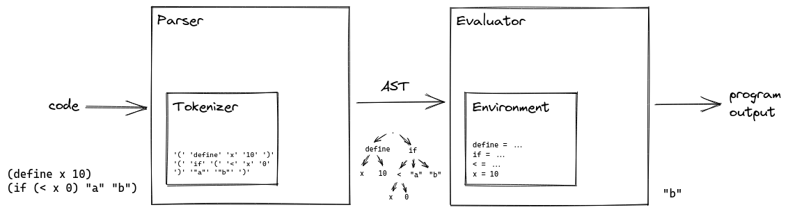

# Building a<br/>Bullshit Language { data-state="page-title" data-background-image="../images/background.png" }

<!-- markdownlint-disable MD003 MD033 MD045 -->

{ style="height:240px;" }

::: hashtag
{ height=30px } #bullshitlanguage
:::

##

::: superbig
Demo time!
:::

## Jan Ouwens { data-state="page-title" data-background-image="../images/background.png" }

{ .shadow style="height:200px;" }

&nbsp;

{ style="height:40px;margin-top:15px;" } │ [EqualsVerifier](https://jqno.nl/equalsverifier) │ [jqno.nl](https://jqno.nl) │ { style="height:30px;" } [jqno](https://twitter.com/jqno)

::: hashtag
{ style="height:30px;" } #bullshitlanguage
:::

## WHY!?

## WHY!?

<!-- Image: lockdown -->

## WHY!?

<!-- Image: Annotation overuse -->

## WHY!?

<!-- Image: nerd cred -->

##

::: big
AnnotationScript

is

a LISP
:::

# { data-state="page-title" data-background-image="../images/background.png" }

::: superbig
LISP
:::

## What's a LISP?

- Common Lisp
- Scheme
- Emacs
- Racket
- Clojure

## Syntax

```scheme
(define (fizzbuzz x y)
  (cond ((eq? (remainder x 15) 0) (display "FizzBuzz\n"))
        ((eq? (remainder x 3) 0) (display "Fizz\n"))
        ((eq? (remainder x 5) 0) (display "Buzz\n"))
        (else (display x) (display "\n")))

  (cond ((< x y) (fizzbuzz (+ x 1) y))
        (else ())))

(fizzbuzz 1 100)
```

## The Power of LISP

```lisp
(+ x 10)

((if (#t) + -) x 10)
```

## Map to AnnotationScript

```lisp
(define first (lambda (l) (head l)))
```

## Map to AnnotationScript

```lisp
(
  define
  first
  (
    lambda
    (l)
    (head l))
)
```

## Map to AnnotationScript

```lisp
(
       define
       first
           (
          lambda
              (      l  )
              (      head          l  ) )
)
```

## Map to AnnotationScript

<!-- prettier-ignore -->
```java
@Zero("define")
@Zero("first")
@Zero(list={
    @One("lambda"),
    @One(list={@Two("l")}),
    @One(list={@Two("head"), @Two("l")})})
public static class First {}
```

## Implementing LISP

<!-- Image: rite of passage -->

&nbsp;

&nbsp;

&nbsp;

&nbsp;

&nbsp;

&nbsp;

::: small
Use Peter Norvig's [blog post](https://norvig.com/lispy.html)
:::

# { data-state="page-title" data-background-image="../images/background.png" }

::: big
Implementation
:::

## Architecture


## Architecture



## Tokenizer


## Tokenizer

<!-- prettier-ignore -->
```java
@Zero("if")
@Zero(list={
    @One("<"),
    @One("x"),
    @One("0")
})
@Zero("'a'")
@Zero("'b'")
```

## Tokenizer

<!-- prettier-ignore -->
```java
@Zero("if")       // 'if'
@Zero(list={      // '('
    @One("<"),    // '<'
    @One("x"),    // 'x'
    @One("0")     // '0'
})                // ')'
@Zero("'a'")        // 'a'
@Zero("'b'")        // 'b'
```

DONE! 🥳

##

::: big
But ...

why so `@Weird`?
:::

## Annotations, first try

```java
@Parenthesis("if", @Parenthesis("<", "x", "0"), "'a'", "'b'")
```

## Annotations, first try

 &nbsp; No nesting annotations!

## Annotations, second try

```java
@Open
@Symbol("if")
@Open@Symbol("<")@Symbol("x")@Symbol("0")@Close
@Symbol("'a'")
@Symbol("'b'")
@Close
```

## Annotations, second try

 &nbsp; Sure! I'll group them for you

```java
Open[] opens = { @Open, @Open };
Symbol[] symbols = { @Symbol("if"), @Symbol("x"), @Symbol("0"),
                     @Symbol("'a'"), @Symbol("'b'") };
Close[] closes = { @Close, @Close };
```

## Annotations, third try

```java
public @interface Syntax {}
public @interface Open extends Syntax {}
public @interface Symbol extends Syntax {}
public @interface Close extends Syntax {}

Syntax[] code = { @Open, @Symbol("if"), @Open, @Symbol("<"),
                  @Symbol("x"), @Symbol("0"), @Close, @Symbol("'a'"),
                  @Symbol("'b'"), @Close };
```

## Annotations, third try

 &nbsp; No extending annotations!

## Annotations, fourth and final try

```java
@Zero("if")
@Zero(list={@One("<"), @One("x"), @One("0")})
@Zero("'a'")
@Zero("'b'")
```

## Annotations, fourth and final try

 &nbsp; I see no issue with that!

## Parser


## Parser

- Atoms (`0`, `'a'`) remain the same
- Symbols (`define`, `if`, `<`) are wrapped in `Symbol` class
- `(` starts a list
- `)` ends a list

```java
List<Object> ast = List.of(
    Symbol("if"),
    List.of(Symbol('<'), Symbol('x'), 0),
    "a",
    "b");
```

## Environment


## Environment


```lisp
(define x 10)
```

## Environment


```lisp
(define x 10)
```

## Evaluator


## Evaluator

Is it an Atom?<br/>`0, 'a'`

↓

Return it

## Evaluator

Is it a Symbol?<br/>`if`, `<`

↓

Look up in Environment<br/>Return it

## Evaluator

Is it a List?<br/>`(< x 0)`

↓

Evaluate all elements<br/>Call function<br/>Return result

# { data-state="page-title" data-background-image="../images/background.png" }

::: superbig
Interlude
:::

## Code generator

## Tokenizer

# { data-state="page-title" data-background-image="../images/background.png" }

::: superbig
Taking it

TOO FAR
:::

## MetaScript

## Tokenizer

## Parser

## Evaluator

## Demo

# { data-state="page-title" data-background-image="../images/background.png" }

::: superbig
Conclusion
:::

## Questions? { data-state="page-title" data-background-image="../images/background.png" }


[jqno.nl/talks/bullshitlanguage](https://jqno.nl/talks/bullshitlanguage)

::: hashtag
{ height=30px } #bullshitlanguage

::: supersmall
image credits: see website
:::
:::
