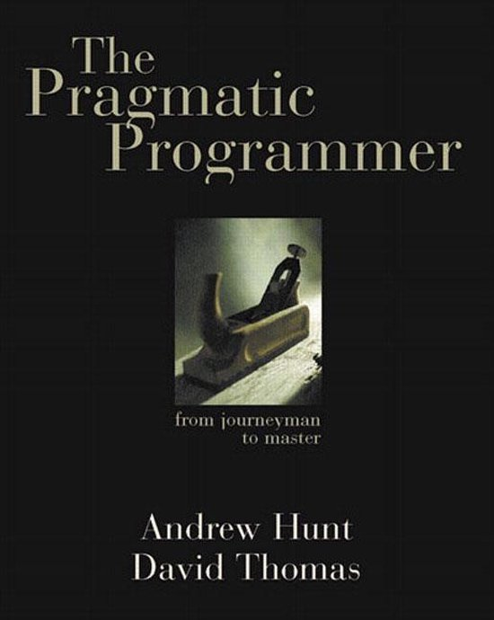
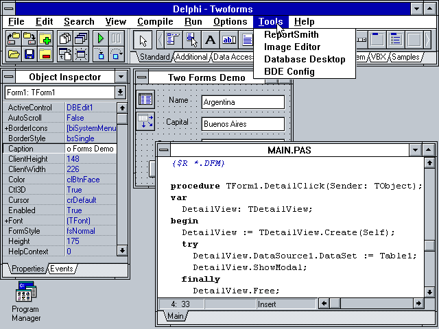

# Fantastic languages
<!-- markdownlint-disable MD045 -->

::: subtitle
{ style="height:2em;" }
and what to learn from them
{ style="height:2em;" }
:::

{ .shadow style="height:320px;" }
{ .shadow style="height:320px;float:left;" }

## { .lineimg } - BASIC - 💻

```basic
10 FOR I = 1 to 100
20 LET S$ = ""
30 IF I % 3 = 0 THEN LET S$ = S$ + "FIZZ"
40 IF I % 5 = 0 THEN LET S$ = S$ + "BUZZ"
50 IF S$ = "" THEN LET S$ = I
60 PRINT S$
70 NEXT I
```

## { .lineimg } - BASIC - 🤔

{ .bigimg }

## { .lineimg } - BASIC - 💡

{ .bigimg }

::: supersmall
from my master's thesis
:::

::: notes
Programming!
:::

## { .lineimg } - PHP - 💻

```php
<?php
for ($i = 1; $i <= 100; $i++)
{
    if (!($i % 15))
        echo "FizzBuzz\n";
    else if (!($i % 3))
        echo "Fizz\n";
    else if (!($i % 5))
        echo "Buzz\n";
    else
        echo "$i\n";
}
?>
```

## { .lineimg } - PHP - 🤔

{ .biglogo }

::: notes
It Just Works™
:::

## { .lineimg } - PHP - 💡

{ .bigimg }

::: notes
Great documentation in a time when this wasn't common
:::

## { .lineimg } - Elm - 💻

```elm
import Html exposing (text)
import List exposing (map)

main =
  List.range 1 100 |> map getWordForNum |> String.join " "
 
getWordForNum num =
  if modBy num 15 == 0 then
    "FizzBuzz"
  else if modBy num 3 == 0 then
    "Fizz"
  else if modBy num 5 == 0 then
    "Buzz"
  else
    String.fromInt num
```

## { .lineimg } - Elm - 🤔

```sh
I got to the end of the line without seeing the closing double quote:

6| helloworld = "Hello world
                             ^
Strings look like "this" with double quotes on each end. Is the closing double
quote missing in your code?

Note: For a string that spans multiple lines, you can use the multi-line string
syntax like this:

    """
    # Multi-line Strings
    
    - start with triple double quotes
    - write whatever you want
    - no need to escape newlines or double quotes
    - end with triple double quotes
    """
```

## { .lineimg } - Elm - 💡

{ .bigimg }

::: notes
Even I can do front-end
:::

## { .lineimg } - Lisp - 💻

```lisp
(define (fizzbuzz x y)
  (println
    (cond ((= (modulo x 15) 0) "FizzBuzz")
          ((= (modulo x 3) 0) "Fizz")
          ((= (modulo x 5) 0) "Buzz")
          (else x)))
 
    (if (< x y) (fizzbuzz (+ x 1) y)))
 
(fizzbuzz 1 100)
```

::: supersmall
Scheme dialect
:::

## { .lineimg } - Lisp - 🤔

Minimal syntax, maximal power

```lisp
(println "Hello world")

(+ 1 (* 2 3) 4)

(define Y
  (lambda (f)
    (f (lambda (x) ((Y f) x)))))
```

## { .lineimg } - Lisp - 💡

{ .bigimg }

::: notes
beautiful, elegant, undecipherable, full of meaning
:::

## { .lineimg } - Delphi - 💻

```pascal
program FizzBuzz;
var
  i: Integer;
begin
  for i := 0 to 100 do
  begin
    if i mod 15 = 0 then
      WriteLn('FizzBuzz');
    else if i mod 3 = 0 then
      WriteLn('Fizz');
    else if i mod 5 = 0 then
      WriteLn('Buzz');
    else
      WriteLn(IntToStr(i));
  end;
end.
```

## { .lineimg } - Delphi - 🤔

{ .bigimg }

## { .lineimg } - Delphi - 💡

{ .bigimg }

## { .lineimg } - AnnotationScript - 💻

```java
import nl.jqno.annotationscript.AnnotationScript;
import nl.jqno.annotationscript.Annotations.*;

@Zero("begin")
@Zero(list={@One("define"), @One("fizz-buzz"), @One(list={@Two("lambda"), @Two(list=@Three("n")), @Two(list={
    @Three("cond"),
    @Three(list={@Four("="), @Four(list={@Five("%"), @Five("n"), @Five("15")}), @Four("0")}), @Three("'fizzbuzz'"),
    @Three(list={@Four("="), @Four(list={@Five("%"), @Five("n"), @Five("3")}), @Four("0")}), @Three("'fizz'"),
    @Three(list={@Four("="), @Four(list={@Five("%"), @Five("n"), @Five("5")}), @Four("0")}), @Three("'buzz'"),
    @Three("else"), @Three("n")})})})
@Zero(list={@One("map"), @One("println"), @One(list={@Two("map"), @Two("fizz-buzz"), @Two(list={@Three("range"), @Three("1"), @Three("101")})})})
public class FizzBuzz {
    public static void main(String[] args) {
        AnnotationScript.run(FizzBuzz.class);
    }
}
```

## { .lineimg } - AnnotationScript - 🤔

```java
@Autowired @Bean
@Column(name = "id")
@PostMapping("/endpoint/new")
@Test
public void waitwhat() { ... }
```

## { .lineimg } - AnnotationScript - 💡

```lisp
(begin
  (define fizz-buzz (lambda (n) (cond
    (= (% n 15) 0) 'fizzbuzz
    (= (% n 3) 0) 'fizz
    (= (% n 5) 0) 'buzz
    else n)))
  (map println (map fizz-buzz (range 1 101))))
```

## FIN


[jqno.nl/talks/fantasticlanguages](https://jqno.nl/talks/fantasticlanguages)

{ height=30px } #fantasticlanguages

::: supersmall
image credits: see website
:::
