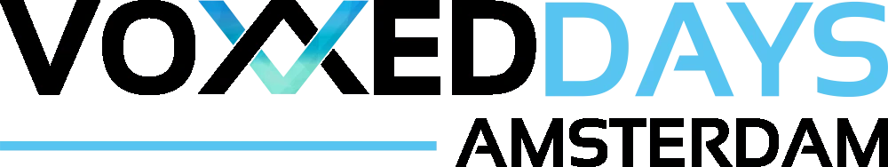
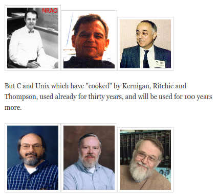
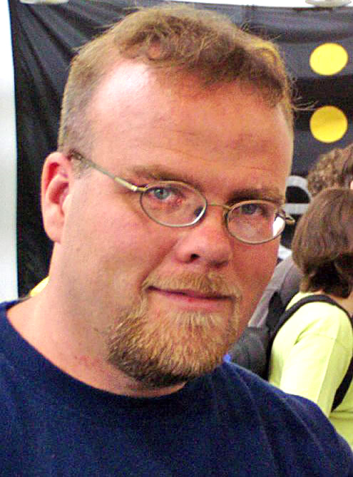
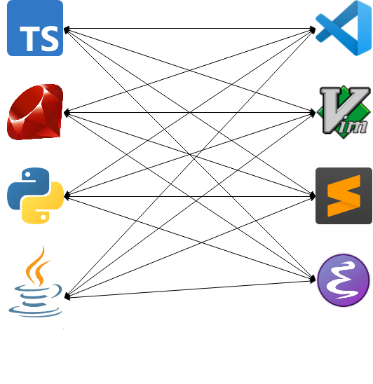
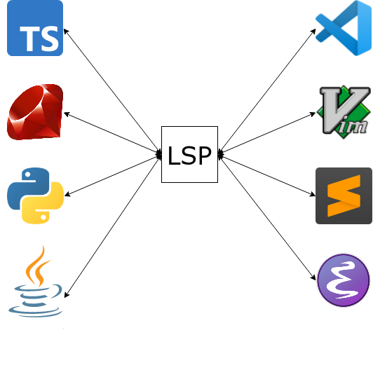
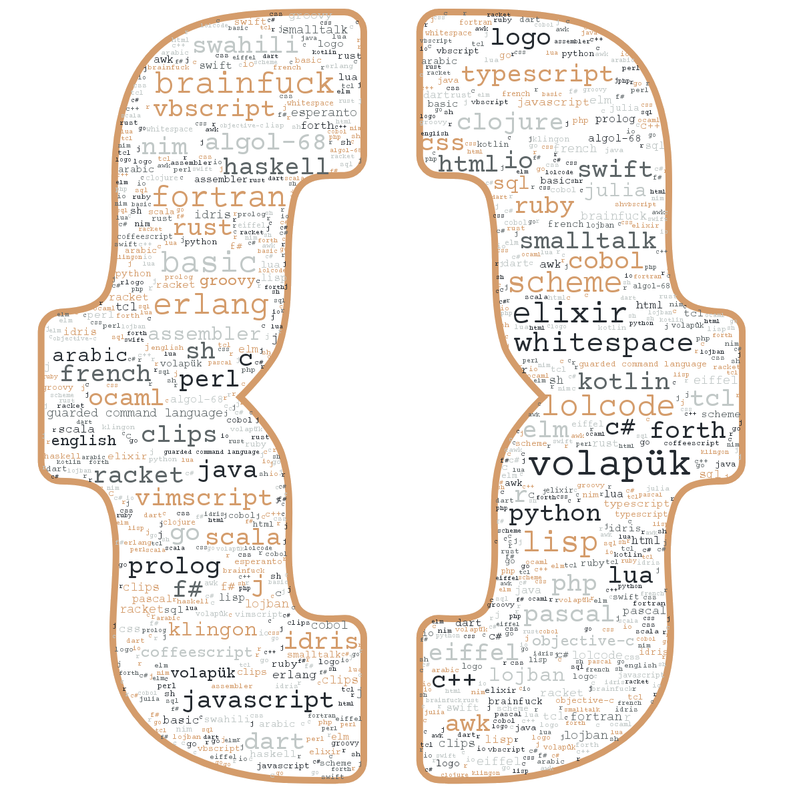
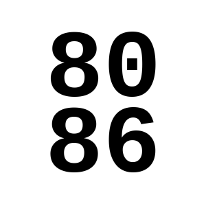
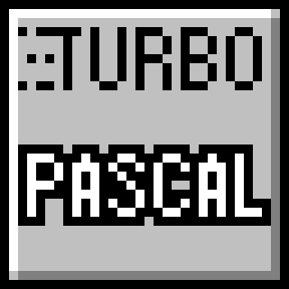

# Fantastic languages

::: subtitle
and what to learn from them
:::

{ .shadow style="height:400px; opacity:0.7;" }

{ style="position:absolute; left:13em; top:8em; width:500px; transform:rotate(30deg);" }

## Learn a language!

{ .bigimg }

## But why?

<br/>

::: superbig
↔️ 🧠 ↔️
:::

::: notes
Influences your thinking
:::

## AI?

<br/>

- Unhelpful for niche languages
- Still ↔️ 🧠 ↔️

## ∀ language

::: supersmall
in increasing order of length
:::

* What?
* Beard?
* FizzBuzz?
* Interesting?
* Changed my thinking?

::: notes
Language of the Year
:::

## Beard 🧔 !?

::: small
viral in 2008:
:::

Computer languages and facial hair [🔗](https://web.archive.org/web/20081013115149/http://blogs.microsoft.co.il/blogs/tamir/archive/2008/04/28/computer-languages-and-facial-hair-take-two.aspx)



## Jan Ouwens

{ .shadow style="height:200px;" }

{ style="height:40px;margin-top:15px;" } │ [EqualsVerifier](https://jqno.nl/equalsverifier) │ [jqno.nl](https://jqno.nl)

# Java

{ .biglogo }

## { .lineimg } - properties

|||
|---|---|
|||
| Appeared in | 1995 |
| Used for | Enterprise back-end, Android |
| Paradigm | object-oriented |
| Typing | strong, static |
| Runtime | JVM |

## { .lineimg } - creator

{ .bigimg }

James Gosling

## { .lineimg } - creator

{ .bigimg }

Beard: ✅

## { .lineimg } - what does it look like?

```java
public class Program {
    public static void main(String...args) {
        for (int i = 1; i <= 100; i++) {
            if (i % 15 == 0) {
                System.out.println("FizzBuzz");
            }
            else if (i % 3 == 0) {
                System.out.println("Fizz");
            }
            else if (i % 5 == 0) {
                System.out.println("Buzz");
            }
            else {
                System.out.println(i);
            }
        }
    }
}
```

## { .lineimg } - what makes it interesting?

{ .bigimg }

## { .lineimg } - how did it change my thinking?

{ .bigimg }

# BASIC

{ .bigimg }

## { .lineimg } - properties

|||
|---|---|
|||
| Appeared in | 1964 |
| Used for | teaching |
| Paradigm | imperative |
| Typing | weak, static with sigils |
| Runtime | interpreted |

## { .lineimg } - creator

{ .bigimg }

John Kemeny & Thomas Kurtz

## { .lineimg } - creator

{ .bigimg }

Beard: ❌❌

## { .lineimg } - what does it look like?

```basic
10 FOR I = 1 to 100
20 LET S$ = ""
30 IF I % 3 = 0 THEN LET S$ = S$ + "FIZZ"
40 IF I % 5 = 0 THEN LET S$ = S$ + "BUZZ"
50 IF S$ = "" THEN LET S$ = I
60 PRINT S$
70 NEXT I
```

## { .lineimg } - what makes it interesting?

{ .bigimg }

## { .lineimg } - how did it change my thinking?

{ .bigimg }

::: supersmall
from my master's thesis
:::

::: notes
Programming!
:::

# PHP

{ .biglogo }

## { .lineimg } - properties

|||
|---|---|
|||
| Appeared in | 1995 |
| Used for | simple back-end |
| Paradigm | imperative |
| Typing | weak, dynamic |
| Runtime | interpreted |

## { .lineimg } - creator

{ .bigimg }

Rasmus Lerdorf

## { .lineimg } - creator

{ .bigimg }

Beard: ❌

## { .lineimg } - what does it look like?

```php
<?php
for ($i = 1; $i <= 100; $i++)
{
    if (!($i % 15))
        echo "FizzBuzz\n";
    else if (!($i % 3))
        echo "Fizz\n";
    else if (!($i % 5))
        echo "Buzz\n";
    else
        echo "$i\n";
}
?>
```

## { .lineimg } - what makes it interesting?

{ .biglogo }

::: notes
It Just Works™
:::

## { .lineimg } - how did it change my thinking?

{ .bigimg }

::: notes
Great documentation in a time when this wasn't common
:::

# Elm

{ .biglogo }

## { .lineimg } - properties

|||
|---|---|
|||
| Appeared in | 2012 |
| Used for | front-end |
| Paradigm | functional |
| Typing | strong, static |
| Runtime | compiled to JavaScript |

## { .lineimg } - creator

{ .bigimg }

Evan Czaplicki

## { .lineimg } - creator

{ .bigimg }

Beard: 🤷

## { .lineimg } - what does it look like?

```elm
import Html exposing (text)
import List exposing (map)

main =
  List.range 1 100 |> map getWordForNum |> String.join " "

getWordForNum num =
  if modBy num 15 == 0 then
    "FizzBuzz"
  else if modBy num 3 == 0 then
    "Fizz"
  else if modBy num 5 == 0 then
    "Buzz"
  else
    String.fromInt num
```

## { .lineimg } - what makes it interesting?

```haskell
helloworld = "Hello world
```

```sh
I got to the end of the line without seeing the closing double quote:

6| helloworld = "Hello world
                             ^
Strings look like "this" with double quotes on each end. Is the closing double
quote missing in your code?

Note: For a string that spans multiple lines, you can use the multi-line string
syntax like this:

    """
    # Multi-line Strings

    - start with triple double quotes
    - write whatever you want
    - no need to escape newlines or double quotes
    - end with triple double quotes
    """
```

## { .lineimg } - how did it change my thinking?

<br/><br/><br/>
<div style="margin-left:5em; font-family:'FiraCode'; font-size:2em; transform:rotate(122deg);">&lt;div&gt;</div>

::: notes
Centering a div is still hard
:::

# Lisp

{ .biglogo }

## { .lineimg } - properties

|||
|---|---|
|||
| Appeared in | 1958 |
| Used for | AI |
| Paradigm | functional |
| Typing | strong, dynamic |
| Runtime | compiled to native |

## { .lineimg } - creator

{ .bigimg }

John McCarthy

## { .lineimg } - creator

{ .bigimg }

Beard: ✅ ✅ ✅

## { .lineimg } - what does it look like?

```scheme
(define (fizzbuzz x y)
  (cond ((eq? (remainder x 15) 0) (display "FizzBuzz\n"))
        ((eq? (remainder x 3) 0) (display "Fizz\n"))
        ((eq? (remainder x 5) 0) (display "Buzz\n"))
        (else (display x) (display "\n")))

  (cond ((< x y) (fizzbuzz (+ x 1) y))
        (else ())))

(fizzbuzz 1 100)
```

::: supersmall
Scheme dialect
:::

## { .lineimg } - what makes it interesting?

Minimal syntax, maximal power

```lisp
(println "Hello world")

(+ 1 (* 2 3) 4)

(define Y
  (lambda (f)
    (f (lambda (x) ((Y f) x)))))
```

## { .lineimg } - how did it change my thinking?

{ .bigimg }

::: notes
beautiful, elegant, undecipherable, full of meaning
:::

# Ruby

{ .biglogo }

## { .lineimg } - properties

|||
|---|---|
|||
| Appeared in | 1995 |
| Used for | scripting, simple back-end |
| Paradigm | object-oriented |
| Typing | strong, duck |
| Runtime | interpreted |

## { .lineimg } - creator

{ .bigimg }

Yukihiro Matsumoto

## { .lineimg } - creator

{ .bigimg }

Beard: ✅

## { .lineimg } - what does it look like?

```ruby
1.upto 100 do |i|
  puts "FizzBuzz" if i % 15 == 0
  puts "Fizz" if i % 3 == 0 and i % 5 != 0
  puts "Buzz" if i % 3 != 0 and i % 5 == 0
  puts i if i % 3 != 0 and i % 5 != 0
end
```

## { .lineimg } - what makes it interesting?

```ruby
class Integer
  def to_xml
    "<int>#{self}</int>"
  end
end

puts 10.to_xml
```

```ruby
class Module
  alias private_old private
  alias public_old public
  alias private public_old
  alias public private_old
end
```

## { .lineimg } - how did it change my thinking?

<br/>


in _production_!?

# Delphi

{ .bigimg }

## { .lineimg } - properties

|||
|---|---|
|||
| Appeared in | 1995 |
| Used for | Windows GUIs |
| Paradigm | object-oriented |
| Typing | strong, static |
| Runtime | compiled to native |

## { .lineimg } - creator

{ .bigimg }

Anders Hejlsberg

## { .lineimg } - creator

{ .bigimg }

Beard: ❌

## { .lineimg } - what does it look like?

```pascal
program FizzBuzz;
var
  i: Integer;
begin
  for i := 0 to 100 do
  begin
    if i mod 15 = 0 then
      WriteLn('FizzBuzz');
    else if i mod 3 = 0 then
      WriteLn('Fizz');
    else if i mod 5 = 0 then
      WriteLn('Buzz');
    else
      WriteLn(IntToStr(i));
  end;
end.
```

## { .lineimg } - what makes it interesting?

{ .bigimg }

## { .lineimg } - how did it change my thinking?

{ .bigimg }

# C\#

{ .biglogo }

## { .lineimg } - properties

|||
|---|---|
|||
| Appeared in | 2000 |
| Used for | Windows GUIs, back-end |
| Paradigm | object-oriented |
| Typing | strong, static |
| Runtime | .NET |

## { .lineimg } - creator

{ .bigimg }

Anders Hejlsberg

## { .lineimg } - creator

{ .bigimg }

Beard: ❌

## { .lineimg } - what does it look like?

```csharp
using System;

class Program
{
    static void Main(string[] args)
    {
        for (int i = 1; i <= 100; i++)
        {
            if (i % 15 == 0)
            {
                Console.WriteLine("FizzBuzz");
            }
            else if (i % 3 == 0)
            {
                Console.WriteLine("Fizz");
            }
            else if (i % 5 == 0)
            {
                Console.WriteLine("Buzz");
            }
            else
            {
                Console.WriteLine(i);
            }
        }
    }
}
```

## { .lineimg } - what makes it interesting?

LINQ

```csharp
var popular = from lang in languages
              where lang.Creator.HasBeard
              select lang.Name;
```

## { .lineimg } - how did it change my thinking?

{ .bigimg }

::: notes
Proprietary tools & libs are OK
:::

# TypeScript

{ .biglogo }

## { .lineimg } - properties

|||
|---|---|
|||
| Appeared in | 2012 |
| Used for | front-end |
| Paradigm | object-oriented |
| Typing | gradual, structural |
| Runtime | compiled to JavaScript |

## { .lineimg } - creator

{ .bigimg }

Anders Hejlsberg

## { .lineimg } - creator

{ .bigimg }

Beard: ❌

## { .lineimg } - what does it look like?

```typescript
for (let i = 1; i < 101; i++) {
    if (i % 15 === 0) {
        console.log('FizzBuzz')
    }
    else if (i % 3 === 0) {
        console.log('Fizz')
    }
    else if (i % 5 === 0) {
        console.log('Buzz')
    }
    else {
        console.log(i)
    }
}
```

## { .lineimg } - what does it look like?

```typescript
for (let i: number = 1; i < 101; i++) {
    if (i % 15 === 0) {
        console.log('FizzBuzz')
    }
    else if (i % 3 === 0) {
        console.log('Fizz')
    }
    else if (i % 5 === 0) {
        console.log('Buzz')
    }
    else {
        console.log(i)
    }
}
```

## { .lineimg } - what makes it interesting?

```typescript
// Lodash's pick() function

function pick(object, paths)

pick({ a: 1, b: 2, c: 3, d: 4 }, ['a', 'd'])
===> { a: 1, d:4 }


```

::: notes
Adds order to JavaScript's chaos
:::

## { .lineimg } - what makes it interesting?

```typescript
// Lodash's pick() function

function pick(object, paths)

pick({ a: 1, b: 2, c: 3, d: 4 }, ['a', 'd'])
===> { a: 1, d:4 }

function pick<O extends object, Keys extends keyof O>
             (object: O, paths: Keys[]): { [K in Keys]: O[K] }
```

## { .lineimg } - how did it change my thinking?

{ .biglogo }

## { .lineimg } - how did it change my thinking?

{ .biglogo }

# AnnotationScript

{ .biglogo }

## { .lineimg } - properties

|||
|---|---|
|||
| Appeared in | 2021 |
| Used for | fun |
| Paradigm | functional |
| Typing | weak, dynamic |
| Runtime | Java annotations 🤯 |

## { .lineimg } - creator

{ .bigimg }

Me!

## { .lineimg } - creator

{ .bigimg }

Beard: ✅

## { .lineimg } - what does it look like?

```java
import nl.jqno.annotationscript.AnnotationScript;
import nl.jqno.annotationscript.Annotations.*;

@Zero("begin")
@Zero(list={@One("define"), @One("fizz-buzz"), @One(list={@Two("lambda"), @Two(list=@Three("n")), @Two(list={
    @Three("cond"),
    @Three(list={@Four("="), @Four(list={@Five("%"), @Five("n"), @Five("15")}), @Four("0")}), @Three("'fizzbuzz'"),
    @Three(list={@Four("="), @Four(list={@Five("%"), @Five("n"), @Five("3")}), @Four("0")}), @Three("'fizz'"),
    @Three(list={@Four("="), @Four(list={@Five("%"), @Five("n"), @Five("5")}), @Four("0")}), @Three("'buzz'"),
    @Three("else"), @Three("n")})})})
@Zero(list={@One("map"), @One("println"), @One(list={@Two("map"), @Two("fizz-buzz"), @Two(list={@Three("range"), @Three("1"), @Three("101")})})})
public class FizzBuzz {
    public static void main(String[] args) {
        AnnotationScript.run(FizzBuzz.class);
    }
}
```

## { .lineimg } - what makes it interesting?

```java
@Autowired @Bean
@Column(name = "id")
@PostMapping("/endpoint/new")
@Test
public void waitwhat() { ... }
```

## { .lineimg } - how did it change my thinking?

```lisp
(begin
  (define fizz-buzz (lambda (n) (cond
    (= (% n 15) 0) 'fizzbuzz
    (= (% n 3) 0) 'fizz
    (= (% n 5) 0) 'buzz
    else n)))
  (map println (map fizz-buzz (range 1 101))))
```

#

{ height=600px }

## Why didn't you talk about

::: small
|||||||
|---|-|-|----|-|-|---|
| | { .lineimg } | Assembler | | { .lineimg } | Kotlin | |
| | { .lineimg } | C | | { .lineimg } | Lua | |
| | { .lineimg } | C++ | | { .lineimg } | Python | |
| | { .lineimg } | Clojure | | { .lineimg } | Rust | |
| | { .lineimg } | Erlang | | { .lineimg } | Scala | |
| | { .lineimg } | Go | | { .lineimg } | Turbo Pascal | |
| | { .lineimg } | JavaScript | | { .lineimg } | VimScript | |
:::

## Wishlist

<br/>

- Gleam { .lineimg }
- OCaml { .lineimg }

## FIN


[jqno.nl/talks/fantasticlanguages](https://jqno.nl/talks/fantasticlanguages)

::: supersmall
image credits: see website
:::
