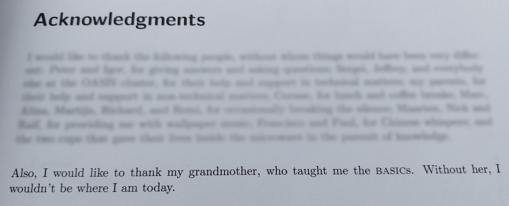

# Fantastic languages

::: subtitle
and what to learn from them
:::

# Why?

* Language of the Year
* Change your thinking

# BASIC

{ .bigimg }

## BASIC - creator

{ .bigimg }

John Kemeny & Thomas Kurtz

## BASIC - creator

{ .bigimg }

Beard: ❌❌

## BASIC - properties

{ .cardimg }

|||
|---|---|
|||
| Typing | weak, static with sigils |
| Runtime | interpreted |
| Memory | not much |
| Appeared in | 1964 |

## BASIC - what does it look like?

```ruby
10 PRINT "HELLO WORLD"
```

## BASIC - what does it look like?

```basic
10 FOR I = 1 to 100
20 LET S$ = ""
30 IF I % 3 = 0 THEN LET S$ = S$ + "FIZZ"
40 IF I % 5 = 0 THEN LET S$ = S$ + "BUZZ"
50 IF S$ = "" THEN LET S$ = I
60 PRINT S$
70 NEXT I
```

## BASIC - what makes it interesting?

* Easy to learn (at the time)
* Ran natively on consumer computers
  * Commodore 64
  * MSX

## BASIC - what did I learn from it?

Programming!

. . .

{ style="height:9em;" }

::: supersmall
from my master's thesis
:::

# Ruby

{ .bigimg }

## Ruby - creator

{ .bigimg }

Yukihiro Matsumoto

## Ruby - creator

{ .bigimg }

Beard: ✅

## Ruby - properties

{ .cardimg }

|||
|---|---|
|||
| Typing | strong, duck |
| Runtime | interpreted |
| Memory | managed |
| Appeared in | 1995 |

## Ruby - what does it look like?

```ruby
puts "Hello World"
```

## Ruby - what does it look like?

```ruby
1.upto 100 do |i|
  string = ""

  string += "Fizz" if i % 3 == 0
  string += "Buzz" if i % 5 == 0
  string = i.to_s if string == ""

  puts "#{i} = #{string}"
end
```

## Ruby - what makes it interesting?

Beautifully consistent OO model

* `Class` is an object
* `Object` is a class

## Ruby - what makes it interesting?

Beautifully extensible OO model

```ruby
class Integer
  def to_xml
    "<int>#{self}</int>"
  end
end

puts 10.to_xml
```

## Ruby - what makes it interesting?

Beautifully _explosive?_ OO model

```ruby
class Module
  alias private_old private
  alias public_old public
  alias private public_old
  alias public private_old
end
```

## Ruby - what did I learn from it?

A new perspective on OO

. . .

The importance of community

::: small
[how it deals with problems](https://gist.github.com/peternixey/1978249)
:::

## FIN

More content to be added later

###
