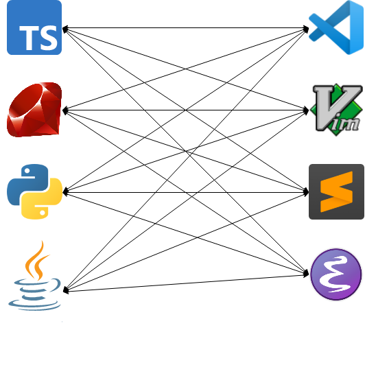

# Fantastic languages
<!-- markdownlint-disable MD045 -->

::: subtitle
and what to learn from them
:::

{ .shadow style="height:400px;" }

## Learn a language!

{ .bigimg }

## ∀ language

::: supersmall
in increasing order of length
:::

* What?
* Beard?
* FizzBuzz?
* Interesting?
* Changed my thinking?

::: notes
Language of the Year
:::

## Beard 🧔 !?

::: small
viral in 2008:
:::

Computer languages and facial hair [🔗](https://web.archive.org/web/20081013115149/http://blogs.microsoft.co.il/blogs/tamir/archive/2008/04/28/computer-languages-and-facial-hair-take-two.aspx)


## Jan Ouwens

{ .shadow style="height:200px;" }

{ style="height:40px;margin-top:15px;" } │ [EqualsVerifier](https://jqno.nl/equalsverifier) │ [jqno.nl](https://jqno.nl) │ { style="height:30px;" } [jqno](https://twitter.com/jqno)

{ style="height:30px;" } #fantasticlanguages

# Java

{ .biglogo }

## { .lineimg } - properties

|||
|---|---|
|||
| Appeared in | 1995 |
| Used for | Enterprise back-end, Android |
| Paradigm | object-oriented |
| Typing | strong, static |
| Runtime | JVM |

## { .lineimg } - creator

{ .bigimg }

James Gosling

## { .lineimg } - creator

{ .bigimg }

Beard: ✅

## { .lineimg } - what does it look like?

```java
public class Program {
    public static void main(String...args) {
        for (int i = 1; i <= 100; i++) {
            if (i % 15 == 0) {
                System.out.println("FizzBuzz");
            }
            else if (i % 3 == 0) {
                System.out.println("Fizz");
            }
            else if (i % 5 == 0) {
                System.out.println("Buzz");
            }
            else {
                System.out.println(i);
            }
        }
    }
}
```

## { .lineimg } - what makes it interesting?

{ .bigimg }

## { .lineimg } - what did I learn from it?

{ .bigimg }

# BASIC

{ .bigimg }

## { .lineimg } - properties

|||
|---|---|
|||
| Appeared in | 1964 |
| Used for | teaching |
| Paradigm | imperative |
| Typing | weak, static with sigils |
| Runtime | interpreted |

## { .lineimg } - creator

{ .bigimg }

John Kemeny & Thomas Kurtz

## { .lineimg } - creator

{ .bigimg }

Beard: ❌❌

## { .lineimg } - what does it look like?

```basic
10 FOR I = 1 to 100
20 LET S$ = ""
30 IF I % 3 = 0 THEN LET S$ = S$ + "FIZZ"
40 IF I % 5 = 0 THEN LET S$ = S$ + "BUZZ"
50 IF S$ = "" THEN LET S$ = I
60 PRINT S$
70 NEXT I
```

## { .lineimg } - what makes it interesting?

{ .bigimg }

## { .lineimg } - what did I learn from it?

{ .bigimg }

::: supersmall
from my master's thesis
:::

::: notes
Programming!
:::

# English

{ .bigimg }

## { .lineimg } - properties

|||
|---|---|
|||
| Appeared in | 16th century CE |
| Used in | UK, America, the internet |
| Family | germanic |
| Script | roman |
| Native speakers | ±380mln |

## { .lineimg } - creator

{ .bigimg }

Let's just say it was this guy

::: notes
Shakespeare invented 1600 words, including "bedroom"
:::

## { .lineimg } - creator

{ .bigimg }

Beard: ✅

## { .lineimg } - what does it look like?

1, 2, fizz, 4, buzz, fizz, 7, 8, fizz, buzz, 11, fizz, 13, 14, fizzbuzz, 16, 17, fizz, 19, buzz, fizz, 22, 23, fizz, buzz, 26, fizz, 28, 29, fizzbuzz

## { .lineimg } - what makes it interesting?

The Great Vowel Shift

| 🇪🇺 | → | 🇬🇧 |
|-|-|-|
| a | → | e |
| e | → | i |
| i | → | ay |

## { .lineimg } - what did I learn from it?

{ .bigimg }

# PHP

{ .biglogo }

## { .lineimg } - properties

|||
|---|---|
|||
| Appeared in | 1995 |
| Used for | simple back-end |
| Paradigm | imperative |
| Typing | weak, dynamic |
| Runtime | interpreted |

## { .lineimg } - creator

{ .bigimg }

Rasmus Lerdorf

## { .lineimg } - creator

{ .bigimg }

Beard: ❌

## { .lineimg } - what does it look like?

```php
<?php
for ($i = 1; $i <= 100; $i++)
{
    if (!($i % 15))
        echo "FizzBuzz\n";
    else if (!($i % 3))
        echo "Fizz\n";
    else if (!($i % 5))
        echo "Buzz\n";
    else
        echo "$i\n";
}
?>
```

## { .lineimg } - what makes it interesting?

{ .biglogo }

::: notes
It Just Works™
:::

## { .lineimg } - what did I learn from it?

{ .bigimg }

::: notes
Great documentation in a time when this wasn't common
:::

# Elm

{ .biglogo }

## { .lineimg } - properties

|||
|---|---|
|||
| Appeared in | 2012 |
| Used for | front-end |
| Paradigm | functional |
| Typing | strong, static |
| Runtime | compiled to JavaScript |

## { .lineimg } - creator

{ .bigimg }

Evan Czaplicki

## { .lineimg } - creator

{ .bigimg }

Beard: 🤷

## { .lineimg } - what does it look like?

```elm
import Html exposing (text)
import List exposing (map)

main =
  List.range 1 100 |> map getWordForNum |> String.join " "
 
getWordForNum num =
  if modBy num 15 == 0 then
    "FizzBuzz"
  else if modBy num 3 == 0 then
    "Fizz"
  else if modBy num 5 == 0 then
    "Buzz"
  else
    String.fromInt num
```

## { .lineimg } - what makes it interesting?

```sh
I got to the end of the line without seeing the closing double quote:

6| helloworld = "Hello world
                             ^
Strings look like "this" with double quotes on each end. Is the closing double
quote missing in your code?

Note: For a string that spans multiple lines, you can use the multi-line string
syntax like this:

    """
    # Multi-line Strings
    
    - start with triple double quotes
    - write whatever you want
    - no need to escape newlines or double quotes
    - end with triple double quotes
    """
```

## { .lineimg } - what did I learn from it?

{ .bigimg }

::: notes
Even I can do front-end
:::

# Lisp

{ .biglogo }

## { .lineimg } - properties

|||
|---|---|
|||
| Appeared in | 1958 |
| Used for | AI |
| Paradigm | functional |
| Typing | strong, dynamic |
| Runtime | compiled to native |

## { .lineimg } - creator

{ .bigimg }

John McCarthy

## { .lineimg } - creator

{ .bigimg }

Beard: ✅ ✅ ✅

## { .lineimg } - what does it look like?

```lisp
(define (fizzbuzz x y)
  (println
    (cond ((= (modulo x 15) 0) "FizzBuzz")
          ((= (modulo x 3) 0) "Fizz")
          ((= (modulo x 5) 0) "Buzz")
          (else x)))
 
    (if (< x y) (fizzbuzz (+ x 1) y)))
 
(fizzbuzz 1 100)
```

::: supersmall
Scheme dialect
:::

## { .lineimg } - what makes it interesting?

Minimal syntax, maximal power

```lisp
(println "Hello world")

(+ 1 (* 2 3) 4)

(define Y
  (lambda (f)
    (f (lambda (x) ((Y f) x)))))
```

## { .lineimg } - what did I learn from it?

{ .bigimg }

::: notes
beautiful, elegant, undecipherable, full of meaning
:::

# Arabic

{ .biglogo }

## { .lineimg } - properties

|||
|---|---|
|||
| Appeared in | 5th century CE |
| Used in | Northern Africa, Middle-East |
| Family | semitic |
| Script | arabic |
| Native speakers | ±350mln |

## { .lineimg } - creator

{ .bigimg }

Unknowable

## { .lineimg } - creator

{ .bigimg }

Beard: { height=40px }

## { .lineimg } - what does it look like?

١ ،٢، فيز، ٤، بوز، فيز، ٧، ٨، فيز، بوز، ١١، فيز، ١٣، ١٤، فيزبوز، ١٦، ١٧، فيز، ١٩، بوز، فيز، ٢٢، ٢٣، فيز، بوز، ٢٦، فيز، ٢٨، ٢٩، فيزبوز

## { .lineimg } - what makes it interesting?

::: small
|||
|-|-|
| hll wrld | hello world |
| مرحبا بالعالم | مَرحَبًا بِالعَالَم |
:::

{ .bigimg style="height:9em;" }

## { .lineimg } - what did I learn from it?

{ .bigimg }

::: supersmall
From _The Arab of the Future 2_ by Riad Sattouf
:::

# Ruby

{ .biglogo }

## { .lineimg } - properties

|||
|---|---|
|||
| Appeared in | 1995 |
| Used for | scripting, simple back-end |
| Paradigm | object-oriented |
| Typing | strong, duck |
| Runtime | interpreted |

## { .lineimg } - creator

{ .bigimg }

Yukihiro Matsumoto

## { .lineimg } - creator

{ .bigimg }

Beard: ✅

## { .lineimg } - what does it look like?

```ruby
1.upto 100 do |i|
  puts "FizzBuzz" if i % 15 == 0
  puts "Fizz" if i % 3 == 0 and i % 5 != 0
  puts "Buzz" if i % 3 != 0 and i % 5 == 0
  puts i if i % 3 != 0 and i % 5 != 0
end
```

## { .lineimg } - what makes it interesting?

```ruby
class Integer
  def to_xml
    "<int>#{self}</int>"
  end
end

puts 10.to_xml
```

```ruby
class Module
  alias private_old private
  alias public_old public
  alias private public_old
  alias public private_old
end
```

## { .lineimg } - what did I learn from it?


::: supersmall
[how the community deals with problems](https://gist.github.com/peternixey/1978249)
:::

# Delphi

{ .bigimg }

## { .lineimg } - properties

|||
|---|---|
|||
| Appeared in | 1995 |
| Used for | Windows GUIs |
| Paradigm | object-oriented |
| Typing | strong, static |
| Runtime | compiled to native |

## { .lineimg } - creator

{ .bigimg }

Anders Hejlsberg

## { .lineimg } - creator

{ .bigimg }

Beard: ❌

## { .lineimg } - what does it look like?

```pascal
program FizzBuzz;
var
  i: Integer;
begin
  for i := 0 to 100 do
  begin
    if i mod 15 = 0 then
      WriteLn('FizzBuzz');
    else if i mod 3 = 0 then
      WriteLn('Fizz');
    else if i mod 5 = 0 then
      WriteLn('Buzz');
    else
      WriteLn(IntToStr(i));
  end;
end.
```

## { .lineimg } - what makes it interesting?

{ .bigimg }

## { .lineimg } - what did I learn from it?

{ .bigimg }

# C\#

{ .biglogo }

## { .lineimg } - properties

|||
|---|---|
|||
| Appeared in | 2000 |
| Used for | Windows GUIs, back-end |
| Paradigm | object-oriented |
| Typing | strong, static |
| Runtime | .NET |

## { .lineimg } - creator

{ .bigimg }

Anders Hejlsberg

## { .lineimg } - creator

{ .bigimg }

Beard: ❌

## { .lineimg } - what does it look like?

```csharp
using System;

class Program
{
    static void Main(string[] args)
    {
        for (int i = 1; i <= 100; i++)
        {
            if (i % 15 == 0)
            {
                Console.WriteLine("FizzBuzz");
            }
            else if (i % 3 == 0)
            {
                Console.WriteLine("Fizz");
            }
            else if (i % 5 == 0)
            {
                Console.WriteLine("Buzz");
            }
            else
            {
                Console.WriteLine(i);
            }
        }
    }
}
```

## { .lineimg } - what makes it interesting?

```csharp
using System;
using System.Linq;

class Program
{
    static void Main(string[] args)
    {
        var result = from i in Enumerable.Range(1, 100)
                        select (i % 15 == 0) ? "BuzzFizz" :
                            (i % 5 == 0) ? "Buzz" :
                            (i % 3 == 0) ? "Fizz" :
                            i.ToString();
        result.ForEach(Console.WriteLine);
    }
}
```

## { .lineimg } - what did I learn from it?

{ .bigimg }

::: notes
Proprietary tools & libs are OK
:::

# TypeScript

{ .biglogo }

## { .lineimg } - properties

|||
|---|---|
|||
| Appeared in | 2012 |
| Used for | front-end |
| Paradigm | object-oriented |
| Typing | gradual, structural |
| Runtime | compiled to JavaScript |

## { .lineimg } - creator

{ .bigimg }

Anders Hejlsberg

## { .lineimg } - creator

{ .bigimg }

Beard: ❌

## { .lineimg } - what does it look like?

```typescript
for (let i = 1; i < 101; i++) {
    if (i % 15 === 0) {
        console.log('FizzBuzz')
    }
    else if (i % 3 === 0) {
        console.log('Fizz')
    }
    else if (i % 5 === 0) {
        console.log('Buzz')
    }
    else {
        console.log(i)
    }
}
```

## { .lineimg } - what does it look like?

```typescript
for (let i: number = 1; i < 101; i++) {
    if (i % 15 === 0) {
        console.log('FizzBuzz')
    }
    else if (i % 3 === 0) {
        console.log('Fizz')
    }
    else if (i % 5 === 0) {
        console.log('Buzz')
    }
    else {
        console.log(i)
    }
}
```

## { .lineimg } - what makes it interesting?

```typescript
// Lodash's pick() function

function pick(object, paths)

pick({ a: 1, b: 2, c: 3, d: 4 }, ['a', 'd'])
===> { a: 1, d:4 }


```

::: notes
Adds order to JavaScript's chaos
:::

## { .lineimg } - what makes it interesting?

```typescript
// Lodash's pick() function

function pick(object, paths)

pick({ a: 1, b: 2, c: 3, d: 4 }, ['a', 'd'])
===> { a: 1, d:4 }

function pick<O extends object, Keys extends keyof O>
             (object: O, paths: Keys[]): { [K in Keys]: O[K] }
```

## { .lineimg } - what did I learn from it?

{ .biglogo }

## { .lineimg } - what did I learn from it?

{ .biglogo }

# AnnotationScript

{ .biglogo }

## { .lineimg } - properties

|||
|---|---|
|||
| Appeared in | 2021 |
| Used for | fun |
| Paradigm | functional |
| Typing | weak, dynamic |
| Runtime | Java annotations 🤯 |

## { .lineimg } - creator

{ .bigimg }

Me!

## { .lineimg } - creator

{ .bigimg }

Beard: ✅

## { .lineimg } - what does it look like?

```java
import nl.jqno.annotationscript.AnnotationScript;
import nl.jqno.annotationscript.Annotations.*;

@Zero("begin")
@Zero(list={@One("define"), @One("fizz-buzz"), @One(list={@Two("lambda"), @Two(list=@Three("n")), @Two(list={
    @Three("cond"),
    @Three(list={@Four("="), @Four(list={@Five("%"), @Five("n"), @Five("15")}), @Four("0")}), @Three("'fizzbuzz'"),
    @Three(list={@Four("="), @Four(list={@Five("%"), @Five("n"), @Five("3")}), @Four("0")}), @Three("'fizz'"),
    @Three(list={@Four("="), @Four(list={@Five("%"), @Five("n"), @Five("5")}), @Four("0")}), @Three("'buzz'"),
    @Three("else"), @Three("n")})})})
@Zero(list={@One("map"), @One("println"), @One(list={@Two("map"), @Two("fizz-buzz"), @Two(list={@Three("range"), @Three("1"), @Three("101")})})})
public class FizzBuzz {
    public static void main(String[] args) {
        AnnotationScript.run(FizzBuzz.class);
    }
}
```

## { .lineimg } - what makes it interesting?

```java
@Autowired @Bean
@Column(name = "id")
@PostMapping("/endpoint/new")
@Test
public void waitwhat() { ... }
```

## { .lineimg } - what did I learn from it?

```lisp
(begin
  (define fizz-buzz (lambda (n) (cond
    (= (% n 15) 0) 'fizzbuzz
    (= (% n 3) 0) 'fizz
    (= (% n 5) 0) 'buzz
    else n)))
  (map println (map fizz-buzz (range 1 101))))
```

#

{ height=600px }

## FIN


[jqno.nl/talks/fantasticlanguages](https://jqno.nl/talks/fantasticlanguages)

{ height=30px } #fantasticlanguages

::: supersmall
image credits: see website
:::
