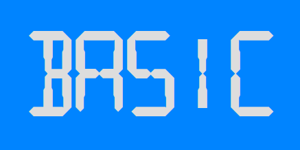
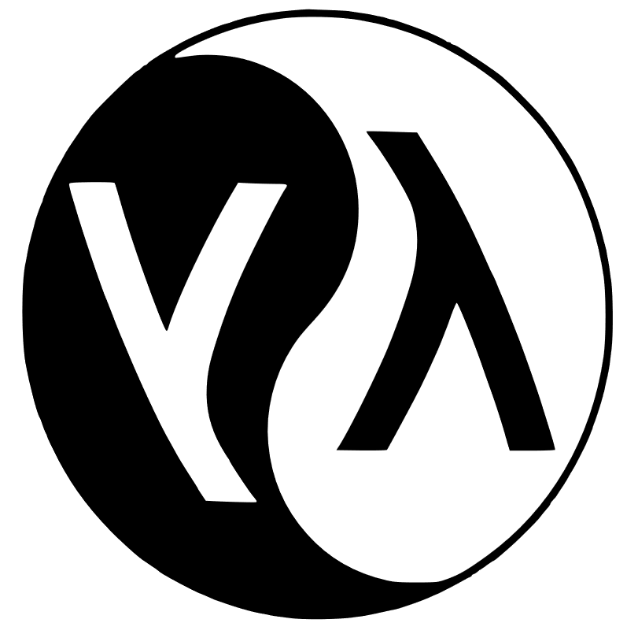

# Fantastic languages
<!-- markdownlint-disable MD045 -->

::: subtitle
and what to learn from them
:::

## Why?

{ .bigimg }

::: notes
Language of the Year
:::

## ∀ language

::: supersmall
in increasing order of length
:::

* Who?
* Beard?
* Pretty?
* Interesting?
* Changed my thinking?

## Beard 🧔 !?

::: small
viral in 2008:
:::

Computer languages and facial hair [🔗](https://web.archive.org/web/20081013115149/http://blogs.microsoft.co.il/blogs/tamir/archive/2008/04/28/computer-languages-and-facial-hair-take-two.aspx)


# Jan Ouwens

{ .portrait style="height:200px;" }

{ style="height:40px;margin-top:15px;" } │ [EqualsVerifier](https://jqno.nl/equalsverifier) │ [jqno.nl](https://jqno.nl) │ { style="height:30px;" } [jqno](https://twitter.com/jqno)

{ style="height:30px;" } #fantasticlanguages

# Java

{ .bigimg }

## { .lineimg } - creator

{ .bigimg }

James Gosling

## { .lineimg } - creator

{ .bigimg }

Beard: ✅

## { .lineimg } - properties

|||
|---|---|
|||
| Typing | strong, static |
| Runtime | JVM |
| Memory | managed |
| Appeared in | 1995 |
| Used for | Enterprise back-end, Android |

## { .lineimg } - what does it look like?

```java
public class Program {
    public static void main(String...args) {
        System.out.println("Hello World");

        for (int i = 1; i <= 100; i++) {
            if (i % 15 == 0) {
                System.out.println("FizzBuzz");
            }
            else if (i % 3 == 0) {
                System.out.println("Fizz");
            }
            else if (i % 5 == 0) {
                System.out.println("Buzz");
            }
            else {
                System.out.println(i);
            }
        }
    }
}
```

## { .lineimg } - what makes it interesting?

{ .bigimg }

## { .lineimg } - what did I learn from it?

{ .bigimg }

# BASIC

{ .bigimg }

## { .lineimg } - creator

{ .bigimg }

John Kemeny & Thomas Kurtz

## { .lineimg } - creator

{ .bigimg }

Beard: ❌❌

## { .lineimg } - properties

|||
|---|---|
|||
| Typing | weak, static with sigils |
| Runtime | interpreted |
| Memory | not much |
| Appeared in | 1964 |
| Used for | teaching |

## { .lineimg } - what does it look like?

```basic
10 PRINT "HELLO WORLD"
20 FOR I = 1 to 100
30 LET S$ = ""
40 IF I % 3 = 0 THEN LET S$ = S$ + "FIZZ"
50 IF I % 5 = 0 THEN LET S$ = S$ + "BUZZ"
60 IF S$ = "" THEN LET S$ = I
70 PRINT S$
80 NEXT I
```

## { .lineimg } - what makes it interesting?

{ .bigimg }

## { .lineimg } - what did I learn from it?

{ .bigimg }

::: supersmall
from my master's thesis
:::

::: notes
Programming!
:::

# English

{ .bigimg }

## { .lineimg } - creator

{ .bigimg }

Let's just say it was this guy

## { .lineimg } - creator

{ .bigimg }

Beard: ✅

## { .lineimg } - properties

|||
|---|---|
|||
| Family | germanic |
| Script | roman |
| Native speakers | ±380mln |
| Appeared in | 16th century CE |
| Used in | UK, America, the internet |

## { .lineimg } - what does it look like?

Hello world

<br/>

1, 2, fizz, 4, buzz, fizz, 7, 8, fizz, buzz, 11, fizz, 13, 14, fizzbuzz, 16, 17, fizz, 19, buzz, fizz, 22, 23, fizz, buzz, 26, fizz, 28, 29, fizzbuzz

## { .lineimg } - what makes it interesting?

| 🇪🇺 | → | 🇬🇧 |
|-|-|-|
| a | → | e |
| e | → | i |
| i | → | ay |

::: supersmall
The Great Vowel Shift
:::

## { .lineimg } - what did I learn from it?

{ .bigimg }

# PHP

{ .bigimg }

## { .lineimg } - creator

{ .bigimg }

Rasmus Lerdorf

## { .lineimg } - creator

{ .bigimg }

Beard: ❌

## { .lineimg } - properties

|||
|---|---|
|||
| Typing | weak, dynamic |
| Runtime | interpreted |
| Memory | managed |
| Appeared in | 1995 |
| Used for | simple back-end |

## { .lineimg } - what does it look like?

```php
<?php
echo "Hello world\n"

for ($i = 1; $i <= 100; $i++)
{
    if (!($i % 15))
        echo "FizzBuzz\n";
    else if (!($i % 3))
        echo "Fizz\n";
    else if (!($i % 5))
        echo "Buzz\n";
    else
        echo "$i\n";
}
?>
```

## { .lineimg } - what makes it interesting?

{ .bigimg }

::: notes
It Just Works™
:::

## { .lineimg } - what did I learn from it?

{ .bigimg }

::: notes
Great documentation in a time when this wasn't common
:::

# Elm

{ .bigimg }

## { .lineimg } - creator

{ .bigimg }

Evan Czaplicki

## { .lineimg } - creator

{ .bigimg }

Beard: 🤷

## { .lineimg } - properties

|||
|---|---|
|||
| Typing | strong, static |
| Runtime | compiled to JavaScript |
| Memory | managed |
| Appeared in | 2012 |
| Used for | front-end |

## { .lineimg } - what does it look like?

```elm
import Html exposing (text)
import List exposing (map)

main = text (helloworld ++ fizzbuzz)

helloworld = "Hello world"

fizzbuzz = List.range 1 100 |> map getWordForNum |> String.join " "
 
getWordForNum num =
  if modBy num 15 == 0 then
    "FizzBuzz"
  else if modBy num 3 == 0 then
    "Fizz"
  else if modBy num 5 == 0 then
    "Buzz"
  else
    String.fromInt num
```

## { .lineimg } - what makes it interesting?

```sh
I got to the end of the line without seeing the closing double quote:

6| helloworld = "Hello world
                             ^
Strings look like "this" with double quotes on each end. Is the closing double
quote missing in your code?

Note: For a string that spans multiple lines, you can use the multi-line string
syntax like this:

    """
    # Multi-line Strings
    
    - start with triple double quotes
    - write whatever you want
    - no need to escape newlines or double quotes
    - end with triple double quotes
    """
```

## { .lineimg } - what did I learn from it?

{ .bigimg }

::: notes
Even I can do front-end
:::

# Lisp

{ .bigimg }

## { .lineimg } - creator

{ .bigimg }

John McCarthy

## { .lineimg } - creator

{ .bigimg }

Beard: ✅ ✅ ✅

## { .lineimg } - properties

|||
|---|---|
|||
| Typing | strong, dynamic |
| Runtime | compiled to native |
| Memory | managed |
| Appeared in | 1958 |
| Used for | AI |

## { .lineimg } - what does it look like?

```lisp
(println "Hello world")

(define (fizzbuzz x y)
  (println
    (cond ((= (modulo x 15) 0) "FizzBuzz")
          ((= (modulo x 3) 0) "Fizz")
          ((= (modulo x 5) 0) "Buzz")
          (else x)))
 
    (if (< x y) (fizzbuzz (+ x 1) y)))
 
(fizzbuzz 1 100)
```

::: supersmall
Scheme dialect
:::

## { .lineimg } - what makes it interesting?

{ .bigimg }

::: notes
homo-iconicity
:::

## { .lineimg } - what did I learn from it?

{ .bigimg }

::: notes
beautiful, elegant, undecipherable, full of meaning
:::

# Arabic

{ .bigimg }

## { .lineimg } - creator

{ .bigimg }

Unknowable

## { .lineimg } - creator

{ .bigimg }

Beard: { height=40px }

## { .lineimg } - properties

|||
|---|---|
|||
| Family | semitic |
| Script | arabic |
| Native speakers | ±350mln |
| Appeared in | 5th century CE |
| Used in | Northern Africa, Middle-East |

## { .lineimg } - what does it look like?

مرحبا بالعالم

<br/>

١ ،٢، فيز، ٤، بوز، فيز، ٧، ٨، فيز، بوز، ١١، فيز، ١٣، ١٤، فيزبوز، ١٦، ١٧، فيز، ١٩، بوز، فيز، ٢٢، ٢٣، فيز، بوز، ٢٦، فيز، ٢٨، ٢٩، فيزبوز

## { .lineimg } - what makes it interesting?

مَرحَبًا بِالعَالَم - مرحبا بالعالم

{ .bigimg }

## { .lineimg } - what did I learn from it?

{ .bigimg }

::: supersmall
From _The Arab of the Future 2_ by Riad Sattouf
:::

# Ruby

{ .bigimg }

## { .lineimg } - creator

{ .bigimg }

Yukihiro Matsumoto

## { .lineimg } - creator

{ .bigimg }

Beard: ✅

## { .lineimg } - properties

|||
|---|---|
|||
| Typing | strong, duck |
| Runtime | interpreted |
| Memory | managed |
| Appeared in | 1995 |
| Used for | scripting, simple back-end |

## { .lineimg } - what does it look like?

```ruby
puts "Hello World"

1.upto 100 do |i|
  puts "FizzBuzz" if i % 15 == 0
  puts "Fizz" if i % 3 == 0 and i % 5 != 0
  puts "Buzz" if i % 3 != 0 and i % 5 == 0
  puts i if i % 3 != 0 and i % 5 != 0
end
```

## { .lineimg } - what makes it interesting?

```ruby
class Integer
  def to_xml
    "<int>#{self}</int>"
  end
end

puts 10.to_xml
```

```ruby
class Module
  alias private_old private
  alias public_old public
  alias private public_old
  alias public private_old
end
```

## { .lineimg } - what did I learn from it?


::: supersmall
[how the community deals with problems](https://gist.github.com/peternixey/1978249)
:::

# Delphi

{ .bigimg }

## { .lineimg } - creator

{ .bigimg }

Anders Hejlsberg

## { .lineimg } - creator

{ .bigimg }

Beard: ❌

## { .lineimg } - properties

|||
|---|---|
|||
| Typing | strong, static |
| Runtime | compiled to native |
| Memory | manual |
| Appeared in | 1995 |
| Used for | Windows GUIs |

## { .lineimg } - what does it look like?

```pascal
program HelloWorld;
var
  i: Integer;
begin
  WriteLn('Hello World');

  for i := 0 to 100 do
  begin
    if i mod 15 = 0 then
      WriteLn('FizzBuzz');
    else if i mod 3 = 0 then
      WriteLn('Fizz');
    else if i mod 5 = 0 then
      WriteLn('Buzz');
    else
      WriteLn(IntToStr(i));
  end;
end.
```

## { .lineimg } - what makes it interesting?

{ .bigimg }

## { .lineimg } - what did I learn from it?

{ .bigimg }

# C\#

{ .bigimg }

## { .lineimg } - creator

{ .bigimg }

Anders Hejlsberg

## { .lineimg } - creator

{ .bigimg }

Beard: ❌

## { .lineimg } - properties

|||
|---|---|
|||
| Typing | strong, static |
| Runtime | .NET |
| Memory | managed |
| Appeared in | 2000 |
| Used for | Windows GUIs, back-end |

## { .lineimg } - what does it look like?

```csharp
using System;

class Program
{
    static void Main(string[] args)
    {
        Console.WriteLine("Hello World");

        for (int i = 1; i <= 100; i++)
        {
            if (i % 15 == 0)
            {
                Console.WriteLine("FizzBuzz");
            }
            else if (i % 3 == 0)
            {
                Console.WriteLine("Fizz");
            }
            else if (i % 5 == 0)
            {
                Console.WriteLine("Buzz");
            }
            else
            {
                Console.WriteLine(i);
            }
        }
    }
}
```

## { .lineimg } - what makes it interesting?

```csharp
using System;
using System.Linq;

class Program
{
    static void Main(string[] args)
    {
        var result = from i in Enumerable.Range(1, 100)
                        select (i % 15 == 0) ? "BuzzFizz" :
                            (i % 5 == 0) ? "Buzz" :
                            (i % 3 == 0) ? "Fizz" :
                            i.ToString();
        result.ForEach(Console.WriteLine);
    }
}
```

## { .lineimg } - what did I learn from it?

{ .bigimg }

::: notes
Proprietary tools & libs are OK
:::

# TypeScript

{ .bigimg }

## { .lineimg } - creator

{ .bigimg }

Anders Hejlsberg

## { .lineimg } - creator

{ .bigimg }

Beard: ❌

## { .lineimg } - properties

|||
|---|---|
|||
| Typing | gradual |
| Runtime | compiled to JavaScript |
| Memory | managed |
| Appeared in | 2012 |
| Used for | front-end |

## { .lineimg } - what does it look like?

```typescript
console.log('Hello world')

for (let i = 1; i < 101; i++) {
    if (i % 15 === 0) {
        console.log('FizzBuzz')
    }
    else if (i % 3 === 0) {
        console.log('Fizz')
    }
    else if (i % 5 === 0) {
        console.log('Buzz')
    }
    else {
        console.log(i)
    }
}
```

## { .lineimg } - what does it look like?

```typescript
console.log('Hello world')

for (let i: number = 1; i < 101; i++) {
    if (i % 15 === 0) {
        console.log('FizzBuzz')
    }
    else if (i % 3 === 0) {
        console.log('Fizz')
    }
    else if (i % 5 === 0) {
        console.log('Buzz')
    }
    else {
        console.log(i)
    }
}
```

## { .lineimg } - what makes it interesting?

```typescript
// Lodash's pick() function

function pick(object, paths)

pick({ a: 1, b: 2, c: 3, d: 4 }, ['a', 'd'])
===> { a: 1, d:4 }


```

::: notes
Adds order to JavaScript's chaos
:::

## { .lineimg } - what makes it interesting?

```typescript
// Lodash's pick() function

function pick(object, paths)

pick({ a: 1, b: 2, c: 3, d: 4 }, ['a', 'd'])
===> { a: 1, d:4 }

function pick<O extends object, Keys extends keyof O>
             (object: O, paths: Keys[]): { [K in Keys]: O[K] }
```

## { .lineimg } - what did I learn from it?

{ .bigimg }

# AnnotationScript

{ .bigimg }

## { .lineimg } - creator

{ .bigimg }

Me!

## { .lineimg } - creator

{ .bigimg }

Beard: ✅

## { .lineimg } - properties

|||
|---|---|
|||
| Typing | weak, dynamic |
| Runtime | interpreted |
| Memory | managed |
| Appeared in | 2021 |
| Used for | fun |

## { .lineimg } - what does it look like?

```java
import nl.jqno.annotationscript.AnnotationScript;
import nl.jqno.annotationscript.Annotations.*;

@Zero("begin")
@Zero(list={@One("println"), @One("'Hello World'")})
@Zero(list={@One("define"), @One("fizz-buzz"), @One(list={@Two("lambda"), @Two(list=@Three("n")), @Two(list={
    @Three("cond"),
    @Three(list={@Four("="), @Four(list={@Five("%"), @Five("n"), @Five("15")}), @Four("0")}), @Three("'fizzbuzz'"),
    @Three(list={@Four("="), @Four(list={@Five("%"), @Five("n"), @Five("3")}), @Four("0")}), @Three("'fizz'"),
    @Three(list={@Four("="), @Four(list={@Five("%"), @Five("n"), @Five("5")}), @Four("0")}), @Three("'buzz'"),
    @Three("else"), @Three("n")})})})
@Zero(list={@One("map"), @One("println"), @One(list={@Two("map"), @Two("fizz-buzz"), @Two(list={@Three("range"), @Three("1"), @Three("101")})})})
public class FizzBuzz {
    public static void main(String[] args) {
        AnnotationScript.run(FizzBuzz.class);
    }
}
```

## { .lineimg } - what makes it interesting?

```java
@Autowired @Bean
@Column(name = "id")
@PostMapping("/endpoint/new")
@Test
public void waitwhat() { ... }
```

```java
@Node({@Node({@Node(val=1), @Node(val=2)})}, @Node(val=3))
public void nope() { ... }
```

## { .lineimg } - what did I learn from it?

```lisp
(begin
  (println 'Hello world')

  (define
    (fizzbuzz (lambda (n) (cond
      ((eq? 0 (mod n 15)) (quote fizzbuzz))
      ((eq? 0 (mod n 3)) (quote fizz))
      ((eq? 0 (mod n 5)) (quote buzz))
      (else n))))
    (define (run (lambda (i end recurse)
      (cond
        ((eq? i end) (quote ()))
        (else
          (cons (fizzbuzz i) (recurse (add1 i) end recurse))))))
      (run 1 31 run))))
  ```

#

{ height=600px }

## FIN


[jqno.nl/talks/fantasticlanguages](https://jqno.nl/talks/fantasticlanguages)

{ height=30px } #fantasticlanguages

::: supersmall
image credits: see website
:::
