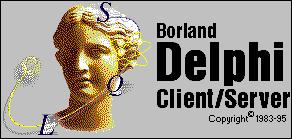
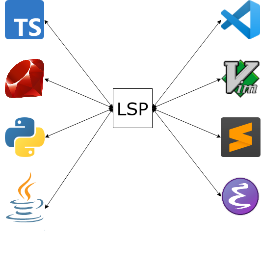

# Fantastic languages
<!-- markdownlint-disable MD045 -->

::: subtitle
and what to learn from them
:::

## Why?

* Language of the Year
* Change your thinking

## ∀ language

::: supersmall
in increasing order of length
:::

* Who?
* Beard?
* Pretty?
* Interesting?
* Changed my thinking?

## Beard 🧔 !?

::: small
viral in 2008:
:::

Computer languages and facial hair [🔗](https://web.archive.org/web/20081013115149/http://blogs.microsoft.co.il/blogs/tamir/archive/2008/04/28/computer-languages-and-facial-hair-take-two.aspx)


# Jan Ouwens

{ .portrait style="height:200px;" }

{ style="height:40px;margin-top:15px;" } │ [EqualsVerifier](https://jqno.nl/equalsverifier) │ [jqno.nl](https://jqno.nl) │ { style="height:30px;" } [jqno](https://twitter.com/jqno)

{ style="height:30px;" } #fantasticlanguages

# Java

{ .bigimg }

## Java - creator

{ .bigimg }

James Gosling

## Java - creator

{ .bigimg }

Beard: ✅

## Java - properties

{ .cardimg }

|||
|---|---|
|||
| Typing | strong, static |
| Runtime | JVM |
| Memory | managed |
| Appeared in | 1995 |
| Used for | Enterprise back-end, Android |

## Java - what does it look like?

```Java
public class Program {
    public static void main(String...args) {
        System.out.println("Hello World");

        for (int i = 1; i <= 100; i++) {
            if (i % 15 == 0) {
                System.out.println("FizzBuzz");
            }
            else if (i % 3 == 0) {
                System.out.println("Fizz");
            }
            else if (i % 5 == 0) {
                System.out.println("Buzz");
            }
            else {
                System.out.println(i);
            }
        }
    }
}
```

## Java - what makes it interesting?

Backwards compatibility

## Java - what did I learn from it?

Open source

# BASIC

{ .bigimg }

## BASIC - creator

{ .bigimg }

John Kemeny & Thomas Kurtz

## BASIC - creator

{ .bigimg }

Beard: ❌❌

## BASIC - properties

{ .cardimg }

|||
|---|---|
|||
| Typing | weak, static with sigils |
| Runtime | interpreted |
| Memory | not much |
| Appeared in | 1964 |
| Used for | teaching |

## BASIC - what does it look like?

```basic
10 PRINT "HELLO WORLD"
20 FOR I = 1 to 100
30 LET S$ = ""
40 IF I % 3 = 0 THEN LET S$ = S$ + "FIZZ"
50 IF I % 5 = 0 THEN LET S$ = S$ + "BUZZ"
60 IF S$ = "" THEN LET S$ = I
70 PRINT S$
80 NEXT I
```

## BASIC - what makes it interesting?

* Easy to learn (at the time)
* Ran natively on consumer computers
  * Commodore 64
  * MSX

## BASIC - what did I learn from it?

Programming!

. . .

{ style="height:9em;" }

::: supersmall
from my master's thesis
:::

# Ruby

{ .bigimg }

## Ruby - creator

{ .bigimg }

Yukihiro Matsumoto

## Ruby - creator

{ .bigimg }

Beard: ✅

## Ruby - properties

{ .cardimg }

|||
|---|---|
|||
| Typing | strong, duck |
| Runtime | interpreted |
| Memory | managed |
| Appeared in | 1995 |
| Used for | scripting, simple back-end |

## Ruby - what does it look like?

```ruby
puts "Hello World"

1.upto 100 do |i|
  string = ""

  string += "Fizz" if i % 3 == 0
  string += "Buzz" if i % 5 == 0
  string = i.to_s if string == ""

  puts "#{i} = #{string}"
end
```

## Ruby - what makes it interesting?

Beautifully consistent OO model

* `Class` is an object
* `Object` is a class

## Ruby - what makes it interesting?

Beautifully extendable OO model

```ruby
class Integer
  def to_xml
    "<int>#{self}</int>"
  end
end

puts 10.to_xml
```

## Ruby - what makes it interesting?

Beautifully _explosive?_ OO model

```ruby
class Module
  alias private_old private
  alias public_old public
  alias private public_old
  alias public private_old
end
```

## Ruby - what did I learn from it?

The importance of community

::: small
[how it deals with problems](https://gist.github.com/peternixey/1978249)
:::

# Arabic

{ .bigimg }

## Arabic - creator

{ .bigimg }

Unknowable

## Arabic - creator

{ .bigimg }

Beard: { height=40px }

## Arabic - properties

{ .cardimg }

|||
|---|---|
|||
| Family | semitic |
| Script | arabic |
| Native speakers | ±350mln |
| Appeared in | 5th century CE |
| Used in | Northern Africa, Middle-East |

## Arabic - what does it look like?

!مرحبا بالعالم

<br/>

١ ،٢، فيز، ٤، بوز، فيز، ٧، ٨، فيز، بوز، ١١، فيز، ١٣، ١٤، فيزبوز، ١٦، ١٧، فيز، ١٩، بوز، فيز، ٢٢، ٢٣، فيز، بوز، ٢٦، فيز، ٢٨، ٢٩، فيزبوز

## Arabic - what makes it interesting?

{ .bigimg }

## Arabic - what did I learn from it?

{ .bigimg }

::: supersmall
From _The Arab of the Future 2_ by Riad Sattouf
:::

# Lisp

{ .bigimg }

## Lisp - creator

{ .bigimg }

John McCarthy

## Lisp - creator

{ .bigimg }

Beard: ✅ ✅ ✅

## Lisp - properties

{ .cardimg }

|||
|---|---|
|||
| Typing | strong, dynamic |
| Runtime | compiled to native |
| Memory | managed |
| Appeared in | 1958 |
| Used for | AI |

## Lisp - what does it look like?

```lisp
(println "Hello world")

(define (fizzbuzz x y)
  (println
    (cond ((= (modulo x 15) 0) "FizzBuzz")
          ((= (modulo x 3) 0) "Fizz")
          ((= (modulo x 5) 0) "Buzz")
          (else x)))
 
    (if (< x y) (fizzbuzz (+ x 1) y)))
 
(fizzbuzz 1 100)
```

::: supersmall
Scheme dialect
:::

## Lisp - what makes it interesting?


::: notes
homo-iconicity
:::

## Lisp - what did I learn from it?

::: superbig
🤯
:::

# C\#

{ .bigimg }

## C\# - creator

{ .bigimg }

Anders Hejlsberg

## C\# - creator

{ .bigimg }

Beard: ❌

## C\# - properties

{ .cardimg }

|||
|---|---|
|||
| Typing | strong, static |
| Runtime | .NET |
| Memory | managed |
| Appeared in | 2000 |
| Used for | Windows GUIs, back-end |

## C\# - what does it look like?

```csharp
using System;

class Program
{
    static void Main(string[] args)
    {
        Console.WriteLine("Hello World");

        for (int i = 1; i <= 100; i++)
        {
            if (i % 15 == 0)
            {
                Console.WriteLine("FizzBuzz");
            }
            else if (i % 3 == 0)
            {
                Console.WriteLine("Fizz");
            }
            else if (i % 5 == 0)
            {
                Console.WriteLine("Buzz");
            }
            else
            {
                Console.WriteLine(i);
            }
        }
    }
}
```

## C\# - what makes it interesting?

```csharp
using System;
using System.Linq;

class Program
{
    static void Main(string[] args)
    {
        var result = from i in Enumerable.Range(1, 100)
                        select (i % 15 == 0) ? "BuzzFizz" :
                            (i % 5 == 0) ? "Buzz" :
                            (i % 3 == 0) ? "Fizz" :
                            i.ToString();
        result.ForEach(Console.WriteLine);
    }
}
```

## C\# - what did I learn from it?

Proprietary tools & libs

# Delphi

{ .bigimg }

## Delphi - creator

{ .bigimg }

Anders Hejlsberg

## Delphi - creator

{ .bigimg }

Beard: ❌

## Delphi - properties

{ .cardimg }

|||
|---|---|
|||
| Typing | strong, static |
| Runtime | compiled to native |
| Memory | manual |
| Appeared in | 1995 |
| Used for | Windows GUIs |

## Delphi - what does it look like?

```pascal
program HelloWorld;
var
  i: Integer;
begin
  WriteLn('Hello World');

  for i := 0 to 100 do
  begin
    if i mod 15 = 0 then
      WriteLn('FizzBuzz');
    else if i mod 3 = 0 then
      WriteLn('Fizz');
    else if i mod 5 = 0 then
      WriteLn('Buzz');
    else
      WriteLn(IntToStr(i));
  end;
end.
```

## Delphi - what makes it interesting?

{ .bigimg }

## Delphi - what did I learn from it?

{ .bigimg }

# TypeScript

{ .bigimg }

## TypeScript - creator

{ .bigimg }

Anders Hejlsberg

## TypeScript - creator

{ .bigimg }

Beard: ❌

## TypeScript - properties

{ .cardimg }

|||
|---|---|
|||
| Typing | gradual |
| Runtime | compiled to JavaScript |
| Memory | managed |
| Appeared in | 2012 |
| Used for | front-end |

## TypeScript - what does it look like?

```typescript
console.log('Hello world')

for (let i = 1; i < 101; i++) {
    if (i % 15 === 0) {
        console.log('FizzBuzz')
    }
    else if (i % 3 === 0) {
        console.log('Fizz')
    }
    else if (i % 5 === 0) {
        console.log('Buzz')
    }
    else {
        console.log(i)
    }
}
```

## TypeScript - what does it look like?

```typescript
console.log('Hello world')

for (let i: number = 1; i < 101; i++) {
    if (i % 15 === 0) {
        console.log('FizzBuzz')
    }
    else if (i % 3 === 0) {
        console.log('Fizz')
    }
    else if (i % 5 === 0) {
        console.log('Buzz')
    }
    else {
        console.log(i)
    }
}
```

## TypeScript - what makes it interesting?

```typescript
// Lodash's pick() function

function pick(object, paths)

pick({ a: 1, b: 2, c: 3, d: 4 }, ['a', 'd'])
===> { a: 1, d:4 }


```

## TypeScript - what makes it interesting?

```typescript
// Lodash's pick() function

function pick(object, paths)

pick({ a: 1, b: 2, c: 3, d: 4 }, ['a', 'd'])
===> { a: 1, d:4 }

function pick<O extends object, Keys extends keyof O>
             (object: O, paths: Keys[]): { [K in Keys]: O[K] }
```

## TypeScript - what did I learn from it?

{ .bigimg }

# AnnotationScript

{ .bigimg }

## AnnotationScript - creator

{ .bigimg }

Me!

## AnnotationScript - creator

{ .bigimg }

Beard: ✅

## AnnotationScript - properties

{ .cardimg }

|||
|---|---|
|||
| Typing | weak, dynamic |
| Runtime | interpreted |
| Memory | managed |
| Appeared in | 2021 |
| Used for | fun |

## AnnotationScript - what does it look like?

```java
import nl.jqno.annotationscript.AnnotationScript;
import nl.jqno.annotationscript.Annotations.*;

@Zero("begin")
@Zero(list={@One("println"), @One("'Hello World'")})
@Zero(list={@One("define"), @One("fizz-buzz"), @One(list={@Two("lambda"), @Two(list=@Three("n")), @Two(list={
    @Three("cond"),
    @Three(list={@Four("="), @Four(list={@Five("%"), @Five("n"), @Five("15")}), @Four("0")}), @Three("'fizzbuzz'"),
    @Three(list={@Four("="), @Four(list={@Five("%"), @Five("n"), @Five("3")}), @Four("0")}), @Three("'fizz'"),
    @Three(list={@Four("="), @Four(list={@Five("%"), @Five("n"), @Five("5")}), @Four("0")}), @Three("'buzz'"),
    @Three("else"), @Three("n")})})})
@Zero(list={@One("map"), @One("println"), @One(list={@Two("map"), @Two("fizz-buzz"), @Two(list={@Three("range"), @Three("1"), @Three("101")})})})
public class FizzBuzz {
    public static void main(String[] args) {
        AnnotationScript.run(FizzBuzz.class);
    }
}
```

## AnnotationScript - what makes it interesting?

Push Java annotations to the limit

## AnnotationScript - what did I learn from it?

Implement a Lisp

#

{ height=600px }

## FIN


[jqno.nl/talks/fantasticlanguages](https://jqno.nl/talks/fantasticlanguages)

{ height=30px } #fantasticlanguages

::: supersmall
image credits: see website
:::
