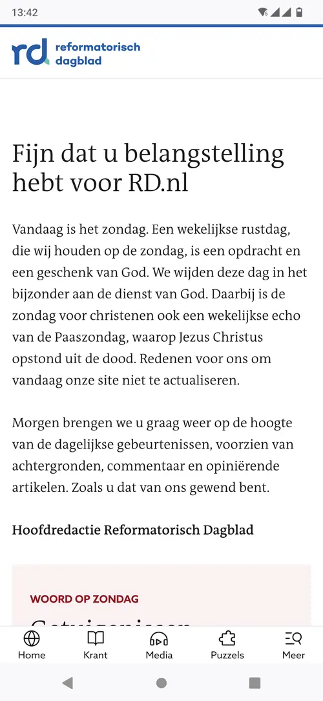

# Less is more

 

reduce $ and CO2 to improve performance 🚀 and joy 🥳

# The un-fun bit

::: small
Source: [K.D. Burke et al. Pliocene and Eocene provide best analogs for near-future climates. PNAS, 2018](https://www.pnas.org/doi/full/10.1073/pnas.1809600115)
:::

## The costs in 2050

- $ 38 000 000 000 000 per year (???)
- 19% loss to world economy

::: small
Source: [M. Kotz, A. Levermann & L. Wenz. The economic commitment of climate change. Nature 628, 551–557 (2024)](https://doi.org/10.1038/s41586-024-07219-0)
:::

## IT's contribution

- Datacenters: ±1% of global CO₂
- Datacenters: ±1-1.5% of global energy
- Networking: ±1-1.5% of global energy

::: small
Source: [IEA. Data Centres and Data Transmission Networks. Retrieved January 2025](https://www.iea.org/energy-system/buildings/data-centres-and-data-transmission-networks)
:::

## IT's contribution

is still growing

# Enough doom & gloom

Let's talk about something fun

## Jan Ouwens { data-state="page-title" data-background-image="../images/background.png" }

{ .shadow style="height:200px;" }

&nbsp;

{ style="height:40px;margin-top:15px;" } │ [EqualsVerifier](https://jqno.nl/equalsverifier) │ [jqno.nl](https://jqno.nl) │ [@jqno.nl](https://bsky.app/profile/jqno.nl)

## Personal things

I'm not perfect 😢

## Personal things

~~Google~~ Ecosia

## Personal things

{ .bigimg }

## My place in this

::: superbig
80s
:::

## My place in this

::: superbig
90s
:::

## My place in this

::: superbig
2000s
:::

## My place in this

"640k ought to be enough for everyone"

## My place in this

<video data-autoplay src="../images/game23.webm"/>

## Moore's law

Machines got faster

Software got slower!?

## Oulipo

# Developers, developers, developers

We can influence bigger things

---

::: big
The next slide

is the most

important one
:::

## Economic model of green software

::: small
Source: [Holly Cummins. The Vroom Model, or Why Naming is The Hardest Problem In Computer Science. 2023](https://hollycummins.com/the-vroom-model-naming/0)
:::

# So what can we do!?

## Stop chasing nines

<!-- architectuur met dubbel uitgevoerde services en een load balancer -->

## Stop chasing nines

  

← Monday

 

Sunday →

## Stop chasing nines

<!-- bricklink -->

## Stop chasing nines

<!-- eenvoudige architectuur -->

## Re-think your DB

<!-- classic architecture -->

## Re-think your DB

::: big
{ style="height:1.4em;" }
:::

## Re-think your DB

- Stable
- Reliable
- Backward-compatible
- Billions(!) of deploys

## Re-think your DB

<!-- sqlite architecture -->

## Re-think your DB

Pros:
- No DB server
- Simplicity

Cons:
- Must carefully tweak defaults
- Only one concurrent write
- Must arrange for backups

## Re-think your DB

 

::: big
{ style="height:1.4em;" } ❤️ { style="height:1.4em;" }
:::

## Make small Docker images

- Need to be stored <!-- disk to CO2 -->
- Need to be transmitted <!-- network to CO2 -->

## Make small Docker images

Hello world: 512MB

. . .

Multi-stage: 426MB

. . .

Minimal base: 202MB

. . .

JLink: 115MB

. . .

GraalVM: 89MB

. . .

Single binary: 16MB

::: small
Source: [My minimal-docker repo](https://github.com/jqno/minimal-docker)
:::

## Enable build caching

<video data-autoplay src="../images/maven.webm"/>

# Conclusion

That most important slide again

## Economic model of green software

::: small
Source: [Holly Cummins. The Vroom Model, or Why Naming is The Hardest Problem In Computer Science. 2023](https://hollycummins.com/the-vroom-model-naming/0)
:::

## Results

- 🤑 Our bosses
- 🚀 Our software
- 💚 The world
- 🥳 Us

# Thank you

 

::: big
¿ ?
:::
