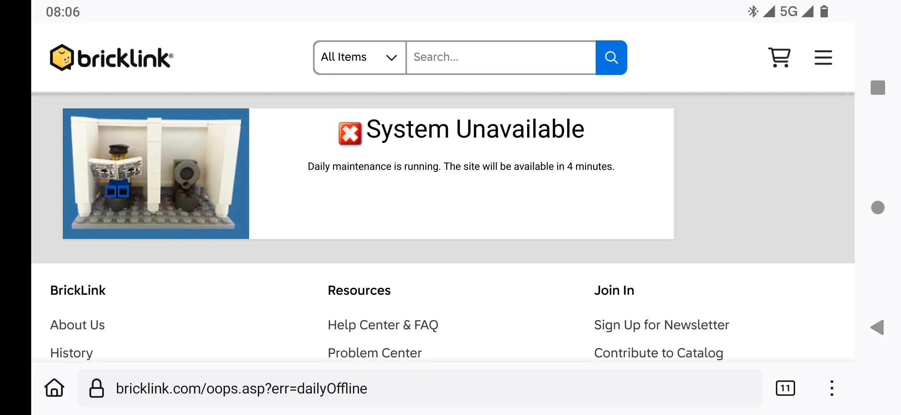
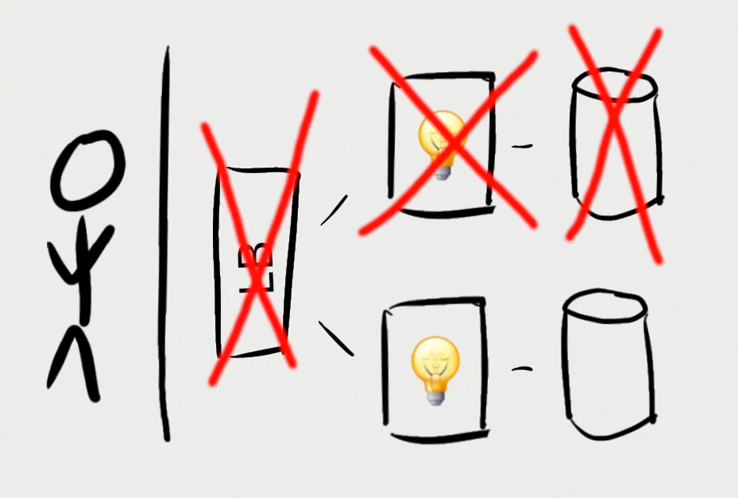
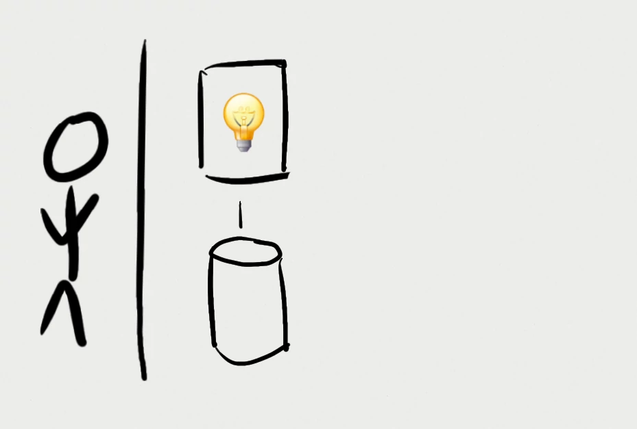
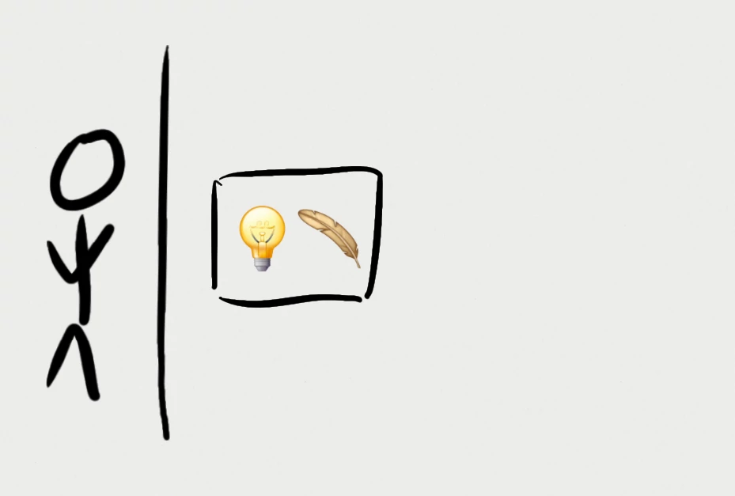

# Less is more

<br/>

_reduce_ $ and CO<sub>2</sub>

to _improve_ performance 🚀 and joy 🥳

# The un-fun bit


::: supersmall
Source: [K.D. Burke et al. Pliocene and Eocene provide best analogs for near-future climates. PNAS, 2018](https://www.pnas.org/doi/full/10.1073/pnas.1809600115)
:::

## The costs in 2050

- _$ trillions_ per year
- _19% loss_ to world economy

<br/><br/><br/><br/><br/>

::: supersmall
Sources:<br/>[M. Kotz, A. Levermann & L. Wenz. The economic commitment of climate change. Nature 628, 551–557 (2024)](https://doi.org/10.1038/s41586-024-07219-0)<br/>[World Economic Forum, 2023](https://www.weforum.org/stories/2023/10/climate-loss-and-damage-cost-16-million-per-hour/)
:::

## IT's contribution

- Datacenters: _±1%_ of global CO₂
- Datacenters: _±1-1.5%_ of global energy
- Networking: _±1-1.5%_ of global energy

<br/><br/><br/><br/><br/>

::: supersmall
Source: [IEA. Data Centres and Data Transmission Networks. Retrieved January 2025](https://www.iea.org/energy-system/buildings/data-centres-and-data-transmission-networks)
:::

## IT's contribution

- Datacenters: _±1%_ of global CO₂
- Datacenters: _±1-1.5%_ of global energy
- Networking: _±1-1.5%_ of global energy

<br/>

...and _growing_

<br/><br/>

::: supersmall
Source: [IEA. Data Centres and Data Transmission Networks. Retrieved January 2025](https://www.iea.org/energy-system/buildings/data-centres-and-data-transmission-networks)
:::

# Enough doom & gloom

Let's talk about something _fun_

## Jan Ouwens { data-state="page-title" data-background-image="../images/background.png" }

{ .shadow style="height:200px;" }

&nbsp;

{ style="height:40px;margin-top:15px;" } │ [EqualsVerifier](https://jqno.nl/equalsverifier) │ [jqno.nl](https://jqno.nl) │ [🦋jqno.nl](https://bsky.app/profile/jqno.nl)

## Personal things

<br/>

I'm not perfect 😢

. . .

<br/>

But I _try_

## Personal things

Google

## Personal things

~~Google~~

{ .bigimg }

## Personal things

{ .bigimg }

## My place in this

::: superbig
80s
:::

## My place in this

::: superbig
90s
:::

"640k ought to be enough for everyone"

## My place in this

::: superbig
2000s
:::

## My place in this

<div style="position:absolute;top:350px;left:430px;">_64KB_ !</div>

<video data-autoplay src="../images/game23.webm" style="position:fixed;top:50px;left:0px;"/>

## Oulipo

{ .bigimg }

## Constraints

::: big
They're _fun_!
:::

## Moore's law

1. Machines got faster
2. Constraints got thrown out
3. Software got _slower_!?

# Developers

We have _power_ over things

many people don't understand

---

::: big
Let's _use_ that power
:::

---

::: big
The next slide

is the most

important one
:::

## Economic model of green software

{ .bigimg }

::: supersmall
<br/>
Source: [Holly Cummins. The Vroom Model, or Why Naming is The Hardest Problem In Computer Science. 2023](https://hollycummins.com/the-vroom-model-naming/0)
:::

# So what can we do!?

## Stop chasing nines

## Stop chasing nines

99.999% uptime

## Stop chasing nines

{ .left .w200 }

{ .right .w200 }

<br/><br/>

← Monday

<br/>

Sunday →

## Stop chasing nines

{ .bigimg }

## Stop chasing nines

{ .bigimg }

## Stop chasing nines

{ .bigimg }

## Stop chasing nines

{ .bigimg }

## Stop chasing nines

{ .bigimg }

## Re-think your DB

## Re-think your DB

::: big
{ style="height:1.4em;" }
:::

## Re-think your DB

SQLite is

- Stable
- Reliable
- Backward-compatible
- Billions(!) of deploys

## Re-think your DB

<br/>

::: big
{ style="height:1.4em;" } ❤️ { style="height:1.4em;" }
:::

## Re-think your DB

{ .bigimg }

## Re-think your DB

{ .bigimg }

## Re-think your DB

Cons:

- Must carefully _tweak defaults_
- _Only one_ concurrent write
- Must arrange for _backups_

## Re-think your DB

Pros:

- _No_ DB server
- Simplicity

## Re-think your DB

{ .bigimg }

## Make small Docker images

## Make small Docker images

- Need to be _stored_<br/>&nbsp;&nbsp;&nbsp;↳ embedded CO₂
- Need to be _transmitted_<br/>&nbsp;&nbsp;&nbsp;↳ actual CO₂

## Make small Docker images

```java
public class Main {
    public static void main(String...args) {
        System.out.println("Hello World!");
    }
}
```

↓


## Make small Docker images

| Tech | size |
|-|-|
| Hello world | 512MB |

## Make small Docker images

| Tech | size |
|-|-|
| Hello world | 512MB |
| Multi-stage | 426MB |

## Make small Docker images

| Tech | size |
|-|-|
| Hello world | 512MB |
| Multi-stage | 426MB |
| Minimal base | 202MB |

## Make small Docker images

| Tech | size |
|-|-|
| Hello world | 512MB |
| Multi-stage | 426MB |
| Minimal base | 202MB |
| JLink | 115MB |

## Make small Docker images

| Tech | size |
|-|-|
| Hello world | 512MB |
| Multi-stage | 426MB |
| Minimal base | 202MB |
| JLink | 115MB |
| GraalVM | 89MB |

## Make small Docker images

| Tech | size |
|-|-|
| Hello world | 512MB |
| Multi-stage | 426MB |
| Minimal base | 202MB |
| JLink | 115MB |
| GraalVM | 89MB |
| Single binary | 16MB |

::: supersmall
Source: [My minimal-docker repo](https://github.com/jqno/minimal-docker)
:::

## Make small Docker images

<span class="big">16MB</span>&nbsp;&nbsp;&nbsp;&nbsp;&nbsp;&gt;&nbsp;&nbsp;&nbsp;&nbsp;&nbsp;<span class="supersmall">_64KB_</span>

## Make small Docker images

{ .bigimg }

## Enable build caching

## Enable build caching

<video data-autoplay src="../images/maven.webm" style="height:10em;box-shadow:0px 15px 25px rgba(0,0,0,0.7);"/>

## Enable build caching

::: big
Every time
:::

## Enable build caching

::: big
Many times

per day
:::

## Enable build caching

::: big
Many times

per _hour_
:::

## Enable build caching

{ .bigimg }

# Many other things

12 minutes is short!

# Conclusion

That _most important_ slide again

## Economic model of green software

{ .bigimg }

::: supersmall
<br/>
Source: [Holly Cummins. The Vroom Model, or Why Naming is The Hardest Problem In Computer Science. 2023](https://hollycummins.com/the-vroom-model-naming/0)
:::

## Results

- 🤑 Our bosses
- 🚀 Our software
- 💚 The world
- 🥳 Us

# Thank you

{ .left .w300 .shadow }

{ .right .w300 .shadow }

<br/>

::: big
_¿ ?_
:::
