# Just enough computer science for the busy developer { data-state="page-portrait" data-background-image="../images/background.png" }

<br/>

I studied computer science so you don't have to

::: hashtag
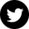{ height=30px } #enoughcs
:::

###

# Just enough computer science for the busy developer { data-state="page-portrait" data-background-image="../images/background.png" }

<br/>

I studied computer science so you don't have to

::: hashtag
{ height=30px } #enoughcs
:::

::: doesitwork
.
:::

##

::: superbig
Why
:::

::: notes
* Not everyone has a CS degree
* That's a good thing
:::

##

::: superbig
Diversity matters
:::

::: notes
* Computers would have remained stuffy
:::

##

::: superbig
Science matters
:::

##

::: big
If you remember only 1 thing
:::

## De Morgan's Laws

Mathy version

::: big
```java
¬(a ⋁ b) == ¬a ⋀ ¬b

¬(a ⋀ b) == ¬a ⋁ ¬b
```
:::

## De Morgan's Laws

Java version

::: big
```java
!(a || b) == !a && !b

!(a && b) == !a || !b
```
:::

## Truth table

 `a`   `b`   `!(a || b)`   `!a && !b`
----- ----- ------------- ------------
  0     0         1            1
  0     1         0            0
  1     0         0            0
  1     1         0            0

## Truth table

 `a`   `b`   `!(a && b)`   `!a || !b`
----- ----- ------------- ------------
  0     0         1            1
  0     1         1            1
  1     0         1            1
  1     1         0            0

##

::: big
If you remember only 2 things
:::

# Jan Ouwens { data-state="page-portrait" data-background-image="../images/background.png" }

{ .portrait style="height:200px;" }

1999 - 2005

{ style="height:40px;margin-top:15px;" } │ [EqualsVerifier](https://jqno.nl/equalsverifier) │ [jqno.nl](https://jqno.nl) │ { style="height:30px;" } [jqno](https://twitter.com/jqno)

::: hashtag
{ style="height:30px;" } #enoughcs
:::

###

##

::: big
Lots of interesting people
:::

# Edsger Dijkstra { data-state="page-portrait" data-background-image="../images/background.png" }

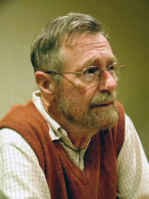{ .portrait }

1930 - 2002

::: notes
* Dutch
* pronounciation
* TU/e
* Quotes:
  * Testing shows the presence, not the absence of bugs 
  * The question of whether Machines Can Think... is about as relevant as the question of whether Submarines Can Swim. 
  * Simplicity is a great virtue but it requires hard work to achieve it and education to appreciate it. And to make matters worse: complexity sells better. 
:::

##

[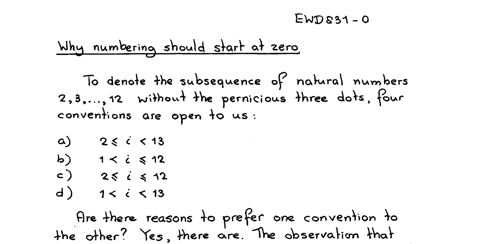](http://www.cs.utexas.edu/users/EWD/transcriptions/EWD08xx/EWD831.html)

## Precondition + Postcondition

::: big
```pascal
   {Precondition}
    Statement
   {Postcondition}
```
:::

## Precondition + Postcondition

::: big
```pascal
   {x = 3}
   x += 1;
   {x = 4}
```
:::

. . .

Q.E.D.

## A simple algorithm

```java
  int[] haystack = ...;
  int needle = ...;
  
  
  int i = 0;
  
  while (haystack[i] != needle) {
  
    i += 1;
  
  }


```

## A simple algorithm

```pascal
  var b: array[0..N] of int = ...;
  var n: int = ...;


  i := 0

; do b[i] ≠ n →

    i := i + 1

  od


```

## A simple algorithm

```pascal
  var b: array[0..N] of int = ...;
  var n: int = ...;

  { ⟨∃x : 0 ≤ x < N : b[x] = n⟩ }
  i := 0
  { i = 0 ⋀ ⟨∃x : 0 ≤ x < N : b[x] = n⟩ }
; do b[i] ≠ n →
    { 0 ≤ i < N ⋀ ⟨∀x : 0 ≤ x ≤ i : b[x] ≠ n⟩ ⋀ ⟨∃x : i < x < N : b[x] = n⟩ }
    i := i + 1
    { 0 < i < N ⋀ ⟨∀x : 0 ≤ x < i : b[x] ≠ n⟩ ⋀ ⟨∃x : i ≤ x < N : b[x] = n⟩ }
  od
  { 0 ≤ i < N ⋀ b[i] = n ⋀ ⟨∀x : 0 ≤ x < i : b[x] ≠ n⟩ }
```

. . .

Q.E.D.

## What it looked like for me

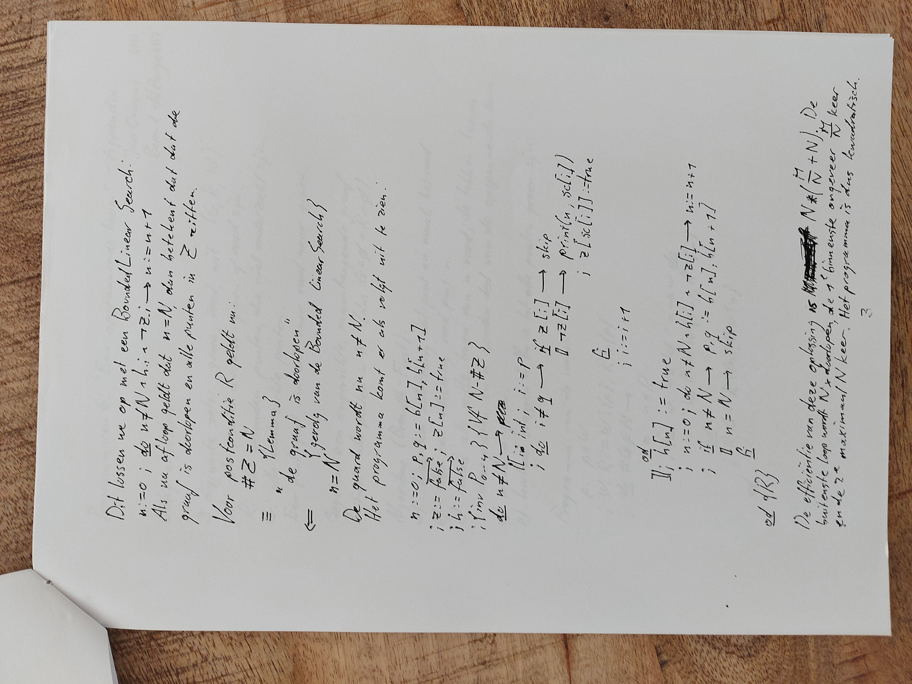{ .raw }\ \ \ \ \ \ 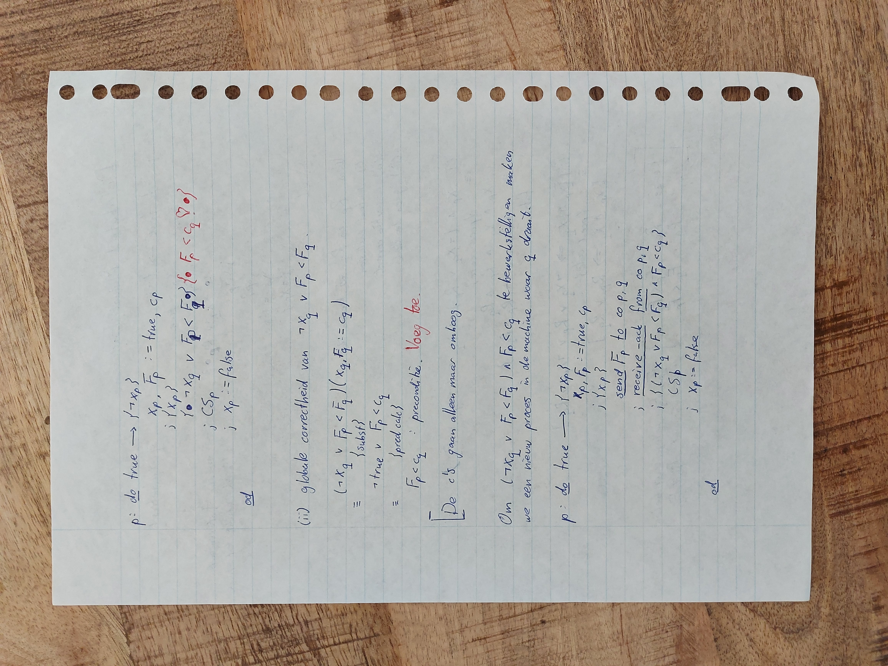{ .raw }

::: notes
* plaatje van mijn huiswerk
:::

##

::: superbig
Speaking of algorithms
:::

# محمد خوارزمی { data-state="page-portrait" data-background-image="../images/background.png" }

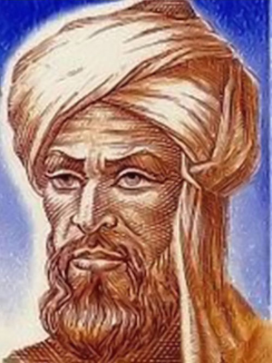{ .portrait }

? - 850

# Muhammad al-Khwarizmi { data-state="page-portrait" data-background-image="../images/background.png" }

{ .portrait }

? - 850

# Algorithmi { data-state="page-portrait" data-background-image="../images/background.png" }

{ .portrait }

? - 850

::: notes
* Islamic world middle ages
* Algorithm
* Moon-crater
:::

##

::: superbig
Algorithm
:::

::: notes
* Cooking recipe
:::

# Katherine Johnson { data-state="page-portrait" data-background-image="../images/background.png" }

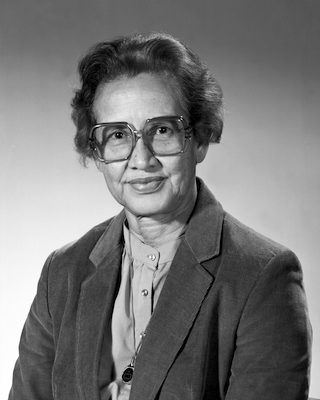{ .portrait }

1918 - 2020

::: notes
* Manual calculations for NASA Apollo
* Movie
* Astronauts didn't trust automation
:::

# Katherine Johnson { data-state="page-portrait" data-background-image="../images/background.png" }

{ .portrait }

2016

::: notes
* Manual calculations for NASA Apollo
* Movie
* Astronauts didn't trust automation
:::

##

::: big
We live in an

age of libraries
:::

Choose the best one

::: notes
how?
:::

## 

::: superbig
Complexity
:::

If input size = N,

How many steps?

## Complexity

```java
public int linearSearch(int needle, int[] haystack) {
  for (int i : haystack) {
    if (haystack[i] == needle) {
      return true;
    }
  }
  return false;
}
```

. . .

$N$ steps

## Complexity

```java
public int get(int[] ints, int index) {
  return ints[index];
}
```

. . .

$1$ step

## Complexity

```java
public boolean hasDuplicates(int[] ints) {
  for (int i : ints) {
    for (int j : b) {
      if (i != j && ints[i] == ints[j]) {
        return true;
      }
    }
  }
  return false;
}
```

. . .

$N^2$ steps

## Complexity

```java
public int fibonacci(int i) {
  if (i <= i) {
    return i;
  }
  return fibonacci(i - 2) + fibonacci(i - 1);
}
```

. . .

$2^N$ steps

## Complexity

Brute-forcing travelling salesman

. . .

$N!$ steps

## Complexity

* Binary search
* Git bisect

. . .

$log\ N$ steps

::: notes
Java's implementation had a bug in it for 9 years
:::

# Donald Knuth { data-state="page-portrait" data-background-image="../images/background.png" }

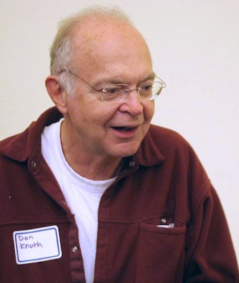{ .portrait }

1938 -

::: notes
* Cheques
* Beware of bugs in the above code; I have only proved it correct, not tried it.
:::

## Big O notation

steps    Big O
-----    -----
$1$      O($1$)
$log\ N$ O($log\ N$)
$N$      O($N$)
$N^2$    O($N^2$)
$2^N$    O($2^N$)

## Big O notation

steps        Big O
-----        -----
$2N$         O($N$)
$42N^2+2N+3$ O($N^2$)

## Big O notation

N           2 10        100                  1000
---         - --        ---                  ----
O($1$)      1 1         1                    1
O($log\ N$) 1 1         2                    3
O($N$)      1 10        100                  1000
O($N^2$)    1 100       10.000               1.000.000
O($2^N$)    2 1024      1,2×10<sup>30</sup>  1,1×10<sup>301</sup>
O($N!$)     1 3.628.800 9,3×10<sup>157</sup> 🤯

## Big O notation

N           name
---         ----
O($1$)      constant
O($log\ N$) logarithmic
O($N$)      linear
O($N^2$)    quadratic
O($2^N$)    exponential
O($N!$)     factorial

## Big O notation

N
---         -            
O($1$)
O($log\ N$)
O($N$)
O($N^2$)    Polynomial ↑ 
O($2^N$)    Slow ↓
O($N!$)

::: notes
polynomial is where the exponent is a number
:::

# Alan Turing { data-state="page-portrait" data-background-image="../images/background.png" }

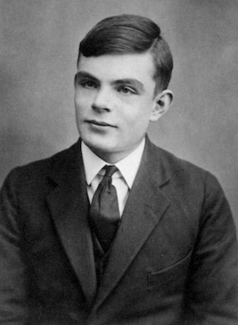{ .portrait }

1912 - 1954

::: notes
* cracked Enigma code
* convicted for being gay
* committed suicide
* movie
:::

# Alan Turing { data-state="page-portrait" data-background-image="../images/background.png" }

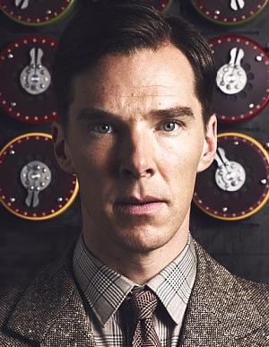{ .portrait }

2014

::: notes
* cracked Enigma code
* convicted for being gay
* committed suicide
* movie
:::

##

::: superbig
Disclaimer
:::

::: notes
I'm oversimplifying things
:::

##

::: big
Cracking codes
:::

worse than polynomial

##

::: big
Verifying codes
:::

polynomial

## NP

* "nondeterministic-polynomial"

* finding an answer: slow
* checking an answer: P

## NP

* Rubik's cube
* Sudoku
* Logistics
* Bitcoin

## NP

Obviously, P ≠ NP

. . .

::: superbig
jè.
:::

::: notes
* Probably P≠NP
* We don't know
* Win $1m
:::

## Depending on P≠NP

* banking
* secure messaging
* society as a whole

# Grace Hopper { data-state="page-portrait" data-background-image="../images/background.png" }

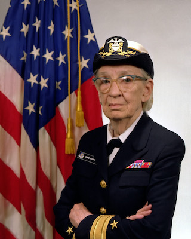{ .portrait }

1906 - 1992

::: notes
* Rear-admiral
* COBOL
* Bug
:::

##

::: superbig
In practice
:::

##

::: big
Know the big O of your algorithms
:::

::: notes
Know if makes sense to optimize
:::

##

::: big
Know your

data structures
:::

## Array

operation big O
--------- -----
access    O($1$)
search    O($N$)
insert    O($N$)
append    O($1$)

## Linked list

operation big O
--------- -----
access    O($N$)
search    O($N$)
insert    O($1$)
append    O($N$)

## HashMap

operation big O
--------- -----
access    n/a
search    O($1$)
iteration O($N$)
insert    O($1$)

## Other data structures

* ArrayList
* LinkedList
* CopyOnWriteArrayList
* Stack
* ~~Vector~~

## Other data structures

* HashSet
* EnumSet
* LinkedHashSet
* SortedSet
* TreeSet

## Other data structures

* HashMap
* EnumMap
* LinkedHashMap
* SortedMap
* TreeMap

## Other data structures

* Queue
* Deque
* ...

##

::: big
Immutable collections
:::

Vavr, Eclipse Collections, Guava

## In Java

No:

```java
ArrayList<String> myList = new ArrayList<>();
```

## In Java

Yes:

```java
List<String> myList = new ArrayList<>();
```

## In Java

Yes:

```java
List<String> myList = new LinkedList<>();
```

## In Java

Yes:

```java
List<String> myList = new CopyOnWriteArrayList<>();
```

# Margaret Hamilton { data-state="page-portrait" data-background-image="../images/background.png" }

{ .portrait }

1936 -

::: notes
* Led the team that wrote NASA's Apollo navigation software
* Coined the term "software engineering"
:::

# Margaret Hamilton { data-state="page-portrait" data-background-image="../images/background.png" }

{ .portrait }

2017

::: notes
* Led the team that wrote NASA's Apollo navigation software
* Coined the term "software engineering"
:::

## Software engineering

* Programming

. . .

* Analysis
* Architecture
* UX design
* Testing

. . .

* Computer science

##

::: big
Wrapping up
:::

## Wrapping up

::: big
Many algorithms solve similar problems
:::

## Wrapping up

::: big
Many data structures solve similar problems
:::

## Wrapping up

::: big
Each performs differently
:::

## Wrapping up

::: big
Think about which is best for your situation
:::

##

::: big
Now you know enough CS!
:::

##

::: superbig
What's next?
:::

## What's next?

Keep this stuff in the back of your mind

## What's next?

Look it up when you need to choose

Tip: Google "Big O cheat sheet"

## What's next?

Read more about this

[{ .raw }](https://pragprog.com/titles/jwdsal2)

## What's next?

Experiment

* Tip:<br/>Implement your own HashMap!

* Advanced tip:<br/>Implement your own compression algorithm!

# Questions? { data-state="page-portrait" data-background-image="../images/background.png" }


<br/>


[jqno.nl/talks/enoughcs](http://jqno.nl/talks/enoughcs)

::: hashtag
{ height=30px } #enoughcs

::: supersmall
image credits: see website
:::
:::

###
