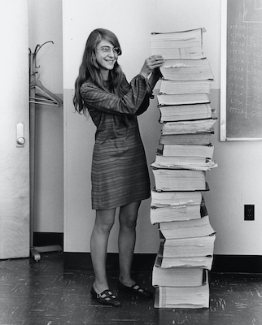

# Just enough computer science for the busy developer

I studied computer science so you don't have to

## Jan Ouwens

<br/><br/><br/><br/>

{style="height:40px;margin-top:15px;"} | [EqualsVerifier](https://jqno.nl/equalsverifier)

 [jqno](https://twitter.com/jqno) | [jqno.nl](https://jqno.nl)

<br/>

::: { style="font-family:TilburgsAns;" }
#enoughcs
:::

## Why

::: notes
* Not everyone has a CS degree
* That's a good thing
:::

## Diversity matters

::: notes
* Computers would have remained stuffy
:::

# Lots of interesting people

# Edsger Dijkstra

<br/>


::: notes
* Dutch
* pronounciation
* Quotes
* TU/e
:::

# Katherine Johnson

<br/>


::: notes
* Manual calculations for NASA Apollo
* LEGO minifig and movie
* Astronauts didn't trust automation
:::

# محمد خوارزمی

<br/>


# Muhammad al-Khwarizmi

<br/>


::: notes
* Islamic world middle ages
* Algorithm
* Moon-crater
:::

## Algorithm

::: notes
* Cooking recipe
:::

# Tony Hoare

<br/>


::: notes
* Invented famous algorithm: quicksort
* Invented 'null' - billion dollar mistake
:::

## Hoare triple

```
{P}
S
{Q}
```

## Hoare triple

```
{x = 3}
x += 1;
{x = 4}
```

. . .

Q.E.D.

## A simple algorithm

```
  int[] b = ...;
  int n = ...;
  
  
  int i = 0;
  
  while (b[i] != n) {
  
    i += 1;
  
  }

```

## A simple algorithm

```
  var b: array[0..N] of int = ...;
  var n: int = ...;


  i := 0

; do b[i] ≠ n →

    i := i + 1

  od


```

## A simple algorithm

```
  var b: array[0..N] of int = ...;
  var n: int = ...;

  { ⟨∃x : 0 ≤ x : b[x] = n⟩ }
  i := 0
  { i = 0 ⋀ ⟨∃x : 0 ≤ x : b[x] = n⟩ }
; do b[i] ≠ n →
    { 0 ≤ i ⋀ ⟨∀x : 0 ≤ x ≤ i : b[x] ≠ n⟩ ⋀ ⟨∃x : i < x : b[x] = n⟩ }
    i := i + 1
    { 0 < i ⋀ ⟨∀x : 0 ≤ x < i : b[x] ≠ n⟩ ⋀ ⟨∃x : i ≤ x : b[x] = n⟩ }
  od
  { 0 ≤ i ⋀ b[i] = n ⋀ ⟨∀x : 0 ≤ x < i : b[x] ≠ n⟩ }
```

## What it looked like for me

::: notes
* plaatje van mijn huiswerk
:::

# Donald Knuth

<br/>


::: notes
Beware of bugs in the above code; I have only proved it correct, not tried it.
:::

## We live in an age of libraries

Choose the best one

::: notes
how?
:::

## Complexity

How many steps?

## Complexity

```
public int linearSearch(int[] b, int n) {
  for (int i : b) {
    if (b[i] == n) {
      return true;
    }
  }
  return false;
}
```

## Complexity

```
public int get(int[] b, int i) {
  return b[i];
}
```

## Big O notation

if N is input size,

* O(N): linear search
* O(1): get

## Big O notation

O(log N)

* Binary search
* Git bisect

::: notes
Java's implementation had a bug in it for 9 years
:::

## Big O notation

O(N²)

```
public boolean hasDuplicates(int[] b) {
  for (int i : b) {
    for (int j : b) {
      if (i != j && b[i] == b[j]) {
        return true;
      }
    }
  }
  return false;
}
```

## Big O notation

O(2<sup>N</sup>)

```
public int fibonacci(int i) {
  if (i <= i) {
    return i;
  }
  return fibonacci(i - 2) + fibonacci(i - 1);
}
```

## Big O notation

O(N!)

Brute-forcing travelling salesman

## Big O notation

N                 name
---               ----
O(1)              constant
O(log N)          logarithmic
O(N)              linear
O(N²)             quadratic
O(2<sup>N</sup>)  exponential
O(N!)             factorial

## Big O notation

N                 2 10        100                  1000
---               - --        ---                  ----
O(1)              1 1         1                    1
O(log N)          1 1         2                    3
O(N)              1 10        100                  1000
O(N²)             1 100       10.000               1.000.000
O(2<sup>N</sup>)  2 1024      1,2×10<sup>30</sup>  1,1×10<sup>301</sup>
O(N!)             1 3.628.800 9,3×10<sup>157</sup> 🤯

## Big O notation

N
---              -            
O(1)
O(log N)
O(N)
O(N²)            Polynomial ↑ 
O(2<sup>N</sup>) Slow ↓
O(N!)

# Alan Turing

<br/>


::: notes
* cracked Enigma code
* convicted for being gay
* committed suicide
* movie
:::

## Cracking codes

worse than polynomial

## Verifying codes

polynomial

## NP

* "nondeterministic-polynomial"

* finding an answer: slow
* checking an answer: P

## NP

Obviously, P ≠ NP

. . .

jè

::: notes
* Probably P≠NP
* We don't know
* Win $1m
:::

## Depending on P≠NP

* banking
* secure messaging
* society as a whole

# Grace Hopper

<br/>


::: notes
* Rear-admiral
* COBOL
* Bug
:::

## In practice

## Array

operation big O
--------- -----
access    O(1)
search    O(N)
insert    O(N)
append    O(1)

## Linked list

operation big O
--------- -----
access    O(N)
search    O(N)
insert    O(1)
append    O(N)

## HashMap

operation big O
--------- -----
access    n/a
search    O(1)
iteration O(N)
insert    O(1)

## Other data structures

* Lists: ArrayList, LinkedList, CopyOnWriteArrayList
* Sets: HashSet, EnumSet, LinkedHashSet
* SortedSet: TreeSet
* Map: HashMap, EnumMap, LinkedHashMap
* SortedMap: TreeMap
* Queue, Deque, ...

## Immutable collections

Use a library

* Vavr
* Eclipse Collections
* Guava

## In Java

No:

```
ArrayList<String> myList = new ArrayList<>();
```

## In Java

Yes:

```
List<String> myList = new ArrayList<>();
```

## In Java

Yes:

```
List<String> myList = new LinkedList<>();
```

## In Java

Yes:

```
List<String> myList = new CopyOnWriteArrayList<>();
```

# Margaret Hamilton

<br/>



::: notes
* Led the team that wrote NASA's Apollo navigation software
* Coined the term "software engineering"
:::

## Software engineering

* Programming

. . .

* Analysis
* Architecture
* UX design
* Testing

. . .

* Computer science

## Wrapping up

* Many similar algorithms
* Many similar data structures
* Each performs differently
* Think about which is best for your situation

## Now you know enough CS!

## What's next?

1. Keep this in the back of your mind
1. Look it up when you need to choose
    * Tip: Google "Big O cheat sheet"
1. Read more about this
    * Tip: [A Common-Sense Guide to Data Structures and Algorithms](https://pragprog.com/titles/jwdsal2)
1. Experiment
    * Tip: Implement your own HashMap!
    * Advanced tip: Implement your own compression algorithm!

# Questions?

<br/>


[jqno.nl/talks/enoughcs](http://jqno.nl/talks/enoughcs)

::: { style="font-family:TilburgsAns;" }
{ height=30px } #enoughcs
:::

